.. -*- encoding: utf-8 -*-

====================
Home-made Toy Motors
====================

.. meta::
       :PG.Title: Home-made Toy Motors
       :PG.Id: 64046
       :PG.Rights: Public Domain
       :PG.Producer: James Simmons
       :PG.Credits: This file was produced from page images at the Internet Archive.
       :DC.Creator: Alfred Powell Morgan
       :DC.Title: Home-made Toy Motors
       :DC.Language: en
       :DC.Created: 1919
       :PG.Released: 2020-12-14
       :coverpage: images/CoverImage.jpg

.. clearpage::

.. pgheader::

.. clearpage::

.. topic:: Transcriber's Note

    This book was transcribed from scans of the original found at the Internet Archive.
        


.. clearpage::

.. container:: titlepage 

   .. container:: center large

       ARTS AND SCIENCES No. 9 

   .. container:: center xx-large

       Home-made 

       Toy Motors 

   .. container:: center x-large

       A Practical Handbook Giving Detailed Instructions for Building 

       Simple but Operative 

       Electric Motors 

   .. container:: center medium

       BY 

       \A. P. Morgan 

   .. container:: center xx-large

       COLE & MORGAN, Inc. 

   .. container:: center large

       Publishers of the Arts and Sciences Series 

       \P. O. BOX 473 CITY HALL STATION 

       NEW YORK, N. Y. 

.. clearpage::

.. container:: center medium

   COPYRIGHT 1919 

   BY 

   COLE & MORGAN, Inc. 

.. cleardoublepage::

.. contents::
   :depth: 2
   :page-numbers:
   :backlinks: none

.. clearpage::

.. lof::
   :page-numbers:
   :backlinks: none
   
.. cleardoublepage::

.. mainmatter::

CHAPTER I. EXPLAINING HOW AN ELECTRIC MOTOR OPERATES. SOME PRINCIPLES OF MAGNETISM. THE DIFFERENCE BETWEEN A SHUNT AND A SERIES MOTOR.
-------------------------------------------------------------------------------------------------------------------------------------- 

**An Electric Motor** is a device for transforming 
electricity into mechanical power. A 
generator, or dynamo, is constructed in almost the same 
identical manner as a motor but its purpose is just the 
opposite. A dynamo transforms **mechanical power into 
electricity**. A dynamo produces electric current, but a 
motor **consumes** it. Some machines can be used either 
as a motor or dynamo—not all however. 

Of course most experimenters have in all probability 
seen many electric motors, but it is more than likely 
that the exact operation is not thoroughly understood. 
Here is your chance to learn. 

The little motors described in this book can each be 
made in two or three hours out of a few scraps of sheet 
iron, magnet wire and screws. The cost of the 
necessary materials is practically negligible. 

One of the main advantages of these little motors is 
that they illustrate the actual principles that are used 
in the large motors, such as are employed everywhere 
for practicable power purposes. 

The iron parts may be made out of sheet iron or the 
ordinary so-called "tin" used in cocoa cans, etc. Thin 
tin can be cut with an ordinary pair of shears. Sheet 
iron such as is used in making stovepipes, etc., is an 
excellent material to use in making these little motors. 
Sheet iron is usually heavier than tin and will have to 
be cut with a pair of "snips." Greater skill will also 
then be required in bending the parts. It is worth 
while noting however, that the extra difficulty involved 
in using the heavier material is worth the trouble 
because it makes possible a more powerful and efficient 
motor. 

The first and easiest type of motor to make is the 
"Simplex." 

**The Principle on which an Electric Motor Operates**
is really very simple. If a current of electricity is 
passed through a copper wire, the wire will attract to 
itself iron filings, etc., as long as the current continues 
to flow. As soon as the current is shut off, the filings 
drop away because the magnetism immediately 
disappears with the cessation of the current. 


   FIG. 1.—If a current of electricity is passed through a wire, the wire will attract to itself iron filings. 

If a wire, carrying a current of electricity is formed 
into a loop, the entire space enclosed by the loop will 
possess the properties of a magnet. 

By forming the wire into several loops or a spiral 
the combined effect of all the individual turns is 
concentrated in a small space and a much more powerful 
field is produced. If the coil is provided with an iron 
core, the magnetism is much more concentrated and 
will exercise a very powerful attractive effect upon any 
neighboring masses of iron or steel. Such a coil is 
called an electromagnet. 

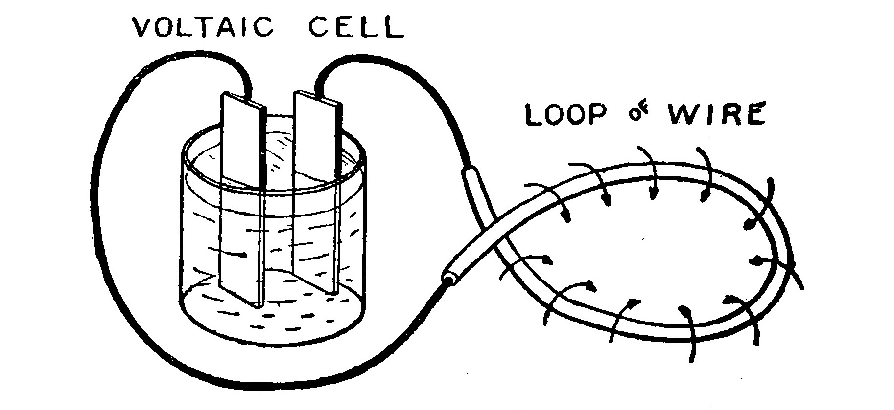

   FIG. 2.—If a wire carrying a current of electricity is formed into a loop, the space enclosed by the loop will become magnetic. The arrows represent the paths of the lines of magnetic force. 

Electromagnets play a very important part in the 
construction of electric motors. The strength of an 
electro magnetic coil is proportional to its ampere 
turns. The number of ampere turns in a coil is 
obtained by multiplying the number of amperes flowing 
through the coil by the number of turns of wire 
composing it. 

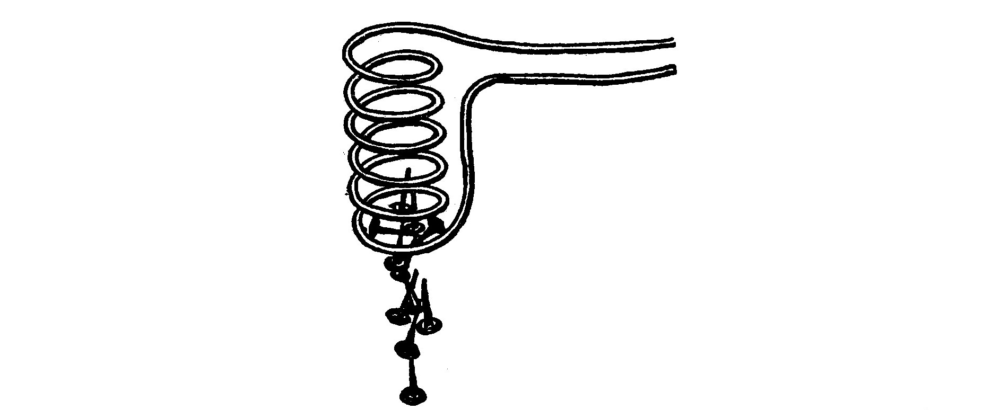

   FIG. 3.—By forming the wire into several loops or a spiral so that the effect of the individual turns is concentrated in a small space, an *Electromagnet* is made. 

You can easily see the effect of turns of wire on an 
electromagnet by winding two or three turns of wire 
around a nail and connecting it to a battery. These 
two or three turns will probably create enough 
magnetism to enable the nail to lift up one or two ordinary 
carpet tacks. 

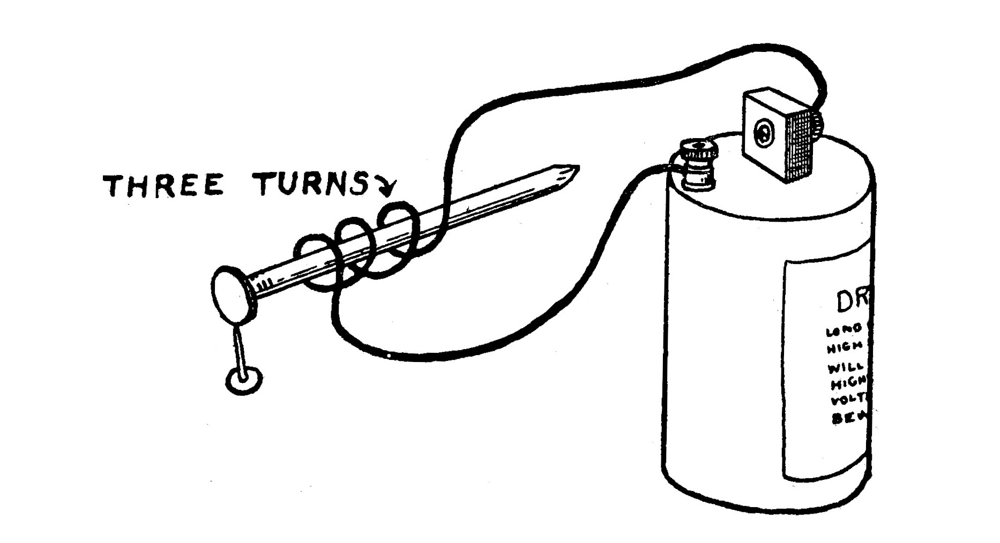

   FIG 4—The strength of an electromagnet is proportional to the ampere turns. The magnet illustrated above does not possess sufficient turns to be very strong. 

Then increase the number of turns to forty or fifty 
and note that the magnetism of the nail has increased 
greatly and that it now possesses power to pick up a 
larger number of tacks at a time. 

From this one may be led to believe that the more 
turns of wire an electromagnet possesses, the stronger 
it will be, and while to a certain extent this is true, 
it should be remembered that it is not simply **turns** 
that count but **ampere turns** and if the number of 
turns of wire is increased beyond a certain point the 
resistance of the coil to the electric current will 
become so great that the current in amperes flowing 
through the coil is greatly reduced and consequently 
also the magnetism is decreased. 

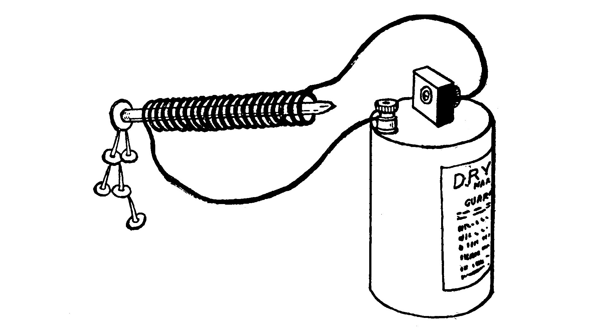

   FIG. 5.—An increase in the number of turns of wire has resulted in considerable increase in the magnetism and this magnet is able to lift a much greater weight than that shown in Figure 4. 

It will be found that the magnetism of an 
electromagnet is strongest at the ends. These places are 
called the poles. 

If you bring one pole of a small electromagnet, 
formed by winding a nail with a few turns of wire, 
near a compass needle, you will find that it will attract 
one end of the compass needle and repel the other. The 
end of the compass needle which points North is called 
a **North** pole. The ends of the electromagnet which 
attracts the North pole of the compass needle is a 
**South** pole. 

One of the most important laws of magnetism is that 
like poles repel each other and unlike poles attract 
each other. A North and a South pole therefore tend 
to pull toward each other, whereas two North poles 
or two South poles repel one another. 

Figure 6 illustrates the principle of an electric motor. 

It consists of a bar of iron marked "A" called the 
**Armature** and wound with a coil of wire called the 
armature winding. The armature is the part of the 
motor which revolves. 

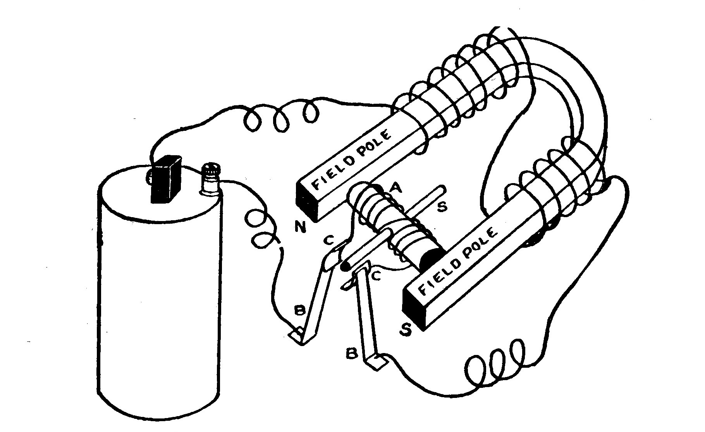

   FIG. 6.—The Principle of the Electric Motor. 

Each end of the armature winding is connected to 
one half of a brass ring called the commutator and 
marked "C, C," in the illustration. The two halves of 
the commutator are insulated from each other and are 
mounted on the armature shaft so that they revolve 
together with the armature. 

The armature revolves between the ends of a 
horseshoe shaped piece of iron called the field. The field is 
also wound with a coil of wire called the **field winding** 
or sometimes the field coil. 

The armature and the field are both electromagnets. 

Two strips of copper, "B, B," bear against the 
commutator. These are the **brushes**, and their purpose is 
to lead the current to the armature coil. 

One brush is connected to one end of the field coil. 
The other end of the field coil and the other brush are 
connected to a source of electric current. 

As soon as the current is turned on, the armature 
and the field both become magnets. The North pole 
of the field attracts the South pole of the armature and 
vice-versa. The armature starts to move so that the 
poles will come opposite but as the commutator moves 
around and is turned over, the current flows through 
the armature coil in the opposite direction. This 
reverses the magnetism of the armature and that which 
was the South pole become the North pole and 
vice-versa. 

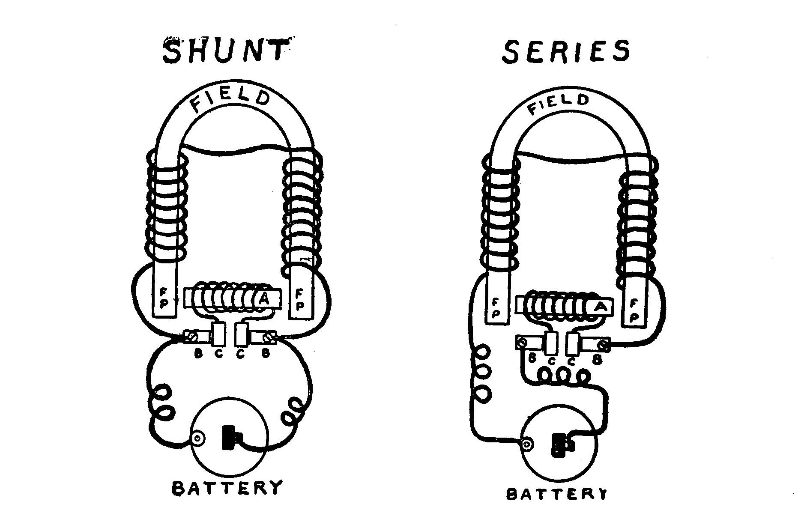

   FIG. 7.—Diagrams showing the difference between a Shunt and a Series Motor. 

The armature poles will therefore have to move 180 
degrees in order that the South pole may come 
opposite the North pole of the field. Before it gets there, 
however, the commutator will have turned over again, 
reversing the current in the armature and making it 
necessary to continue its journey again. This process 
keeps up and so the armature revolves always trying 
to seek a new position which it is prevented from 
remaining at by the action of the commutator. 

Motors are said to be series or shunt wound 
depending on whether all the current flowing through the 
armature also passes through the field or whether it 
divides between the two as shown in Figure 7. 

CHAPTER II. THE CONSTRUCTION OF SIMPLE TOY ELECTRIC MOTORS. 
-----------------------------------------------------------

The Simplex Motor is an interesting little toy 
which can be made in a couple of hours, and 
when finished it will make an instructive model. 

As a motor itself, it is not very efficient, for the 
amount of iron used in its construction is necessarily 
small. The advantage of this particular type of motor 
and the method of making it is that it demonstrates 
the actual principle and the method of application that 
is used in larger machines. 

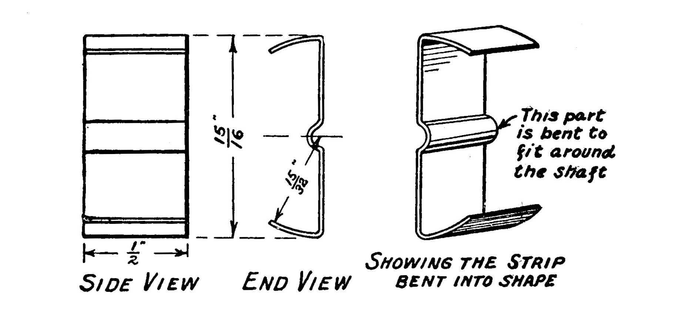

   FIG. 8.—Details of the Armature for the Simplex Two-pole Motor. 

The field of the motor is of the type known as the 
"simplex" while the armature is the "Siemen’s H" or 
two-pole type. The field and the armature are cut 
from ordinary tin-plated iron, such as is used in the 
manufacture of tin cans and cracker boxes. 

The simplest method of securing good flat material 
is to get some old scrap from a plumbing shop. An 
old cocoa tin or baking-powder can may, however, be 
cut up and flattened and will then serve the purpose 
almost as well. 

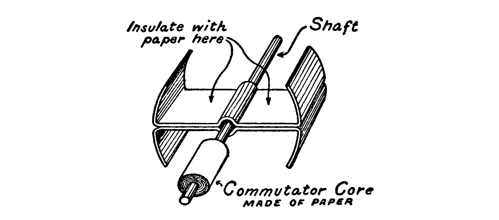

   FIG. 9.—Showing the Armature assembled on the shaft ready for winding. 

**The Armature**—Two strips of tin, one-half of an inch 
by one and one-half inches, are cut to form the 
armature. They are slightly longer than will actually be 
necessary, but are cut to length after the bending 
operations are finished. Mark a line carefully across 
the center of each strip. Then taking care to keep 
the shape symmetrical so that both pieces are exactly 
alike, bend them into the shape shown in Figure 8. 
The small bend in the center is most easily made by 
bending the strip over a knitting-needle and then 
bending it back to the required extent. 

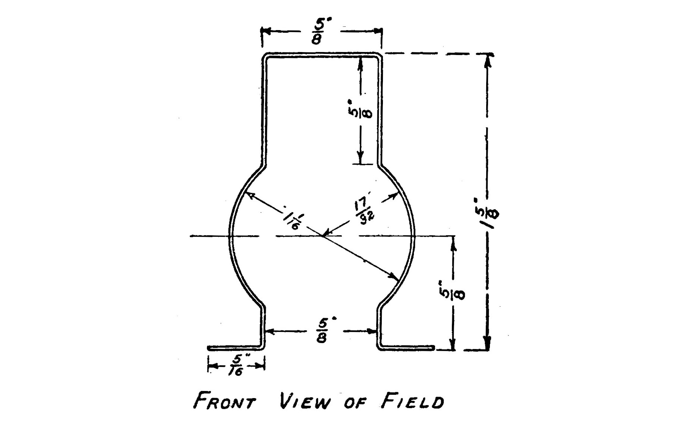

   FIG. 10.—A front view of the Field Frame. 

A piece of knitting-needle one and seven-eighths 
inches long is required for the shaft. Bind the two 
halves of the armature together in the position shown 
in Figure 9. Bind them temporarily with a piece of 
iron wire and solder them together. The wire should 
be removed after they are soldered. 

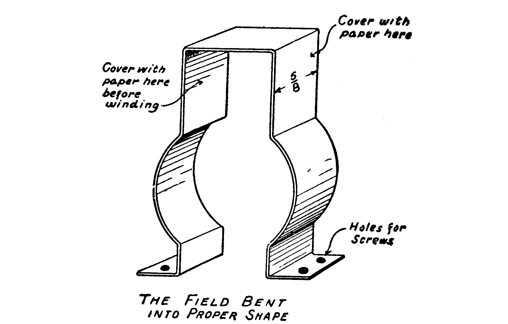

   FIG. 11.—The completed Field Frame, ready for winding. 

**The Field Magnet** is made by first cutting out a 
strip of tin five-eighths of an inch wide by five inches 
long and then bending it into the shape shown in 
Figure 11. The easiest way of doing this with the 
most accuracy is to cut out a piece of wood as a form, 
and then bend the tin over the form. The dimensions 
shown in Figure 10 should be used as a guide when 
making the form. 

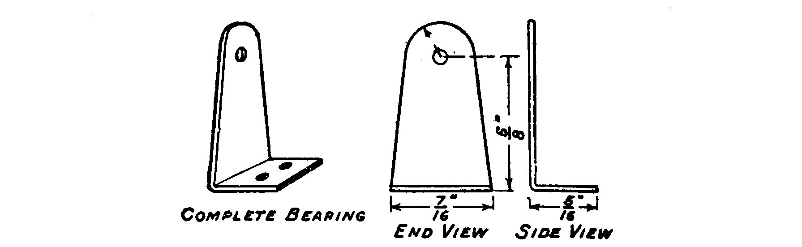

   FIG. 12.—The Bearings. 

Two small holes should be bored in the feet of the 
field magnet to receive No. 8 wood screws, the 
purpose of which is to fasten the field to the base. 

**The Bearings** are shown in detail in Figure 12. They 
are easily made by cutting from sheet tin. Care should 
be taken to make the bearings accurately so that the 
armature will be in the proper position when the motor 
is assembled. Two small washers, serving as collars, 
should be soldered to the shaft as shown in Figure 13. 

**The Commutator Core** is formed by cutting a strip 
of paper three-eighths of an inch wide and about five 
inches long. It should be given a coat of shellac on 
one side and allowed to dry until it gets sticky. The 
strip is then wrapped around the shaft until its 
diameter is three-sixteenths of an inch. The sticky shellac 
should be sufficient to hold the paper tightly in position 
when dry. 

**The Base** is cut from any ordinary piece of wood 
and is in the form of a block about two and one-half 
by one and seven-eighths by one-half inches thick. 

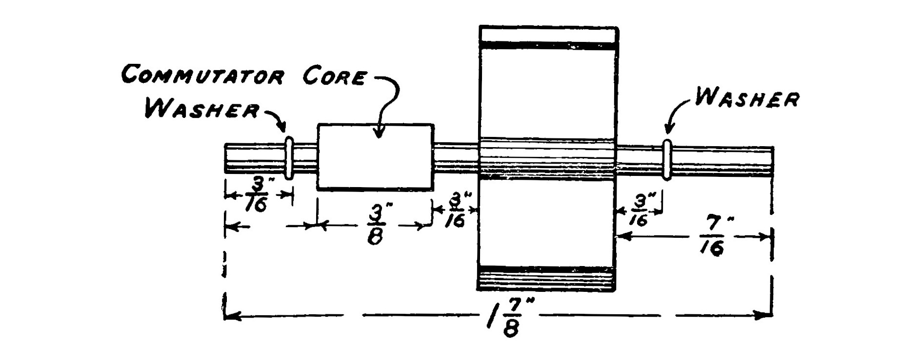
   
   FIG. 13.—Side view of the Armature and Commutator Core assembled on the Shaft before winding. 

**Assembling the Motor**—The parts must be carefully 
prepared for winding by covering with paper. Cut a 
strip of paper five-eighths of an inch wide and one and 
three-eighths inches long and give it a coat of shellac 
on one side. As soon as it becomes sticky, wrap it 
around one of the two upper vertical parts of the field 
magnet as indicated in Figure 11. Both sides of the 
field should be insulated with paper in this manner. 
The armature is insulated in exactly the same way, 
taking care that the paper covers the entire flat portion. 

The field and armature are now ready for winding. 
It is necessary to take proper precautions to prevent 
the first turn from slipping out of place. 

The field should be wound first. This is 
accomplished by looping a small piece of tape or cord over 
it at the point indicated by "A" in Figure 15. The 
next two turns are then taken over the ends of the 
loop so as to embed them. Wind on three layers of 
wire on one side and then run the wire across to the 
other side and wind on three layers there. The third 
layer of wire in the second coil should end at "B." It 
should be fastened into position by a loop of string 
so that it will not unwind. 

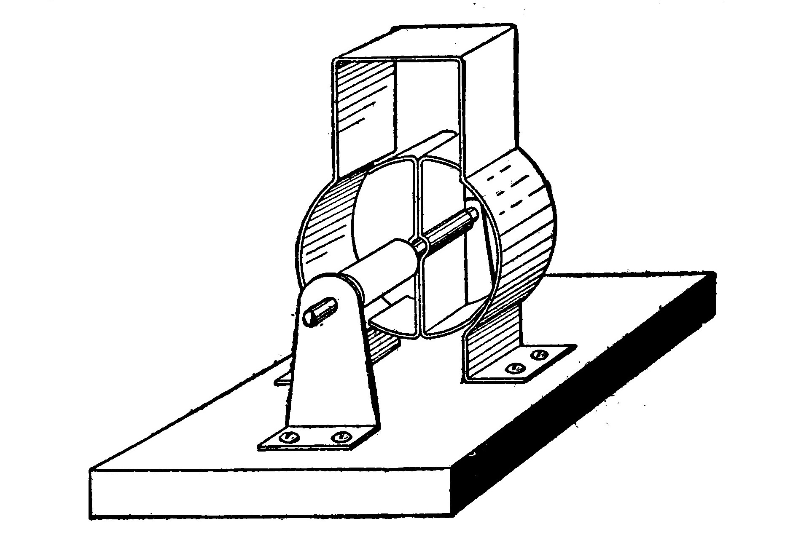
   
   FIG. 14.—Showing the Motor assembled on the Base so that all the parts may be lined up before winding. 

This method divides the field winding into two parts, 
both of which are connected together. The outside 
layer of the first coil is connected to the inside layer 
of the second coil. The two coils really form one 
continuous winding divided into two parts. After the 
winding is finished, give it a coat of shellac. 

The winding of the armature is somewhat more 
difficult. The wire used for winding both the armature 
and the field should be No. 25 or No. 26 B. & S. Gauge 
double cotton-covered. 

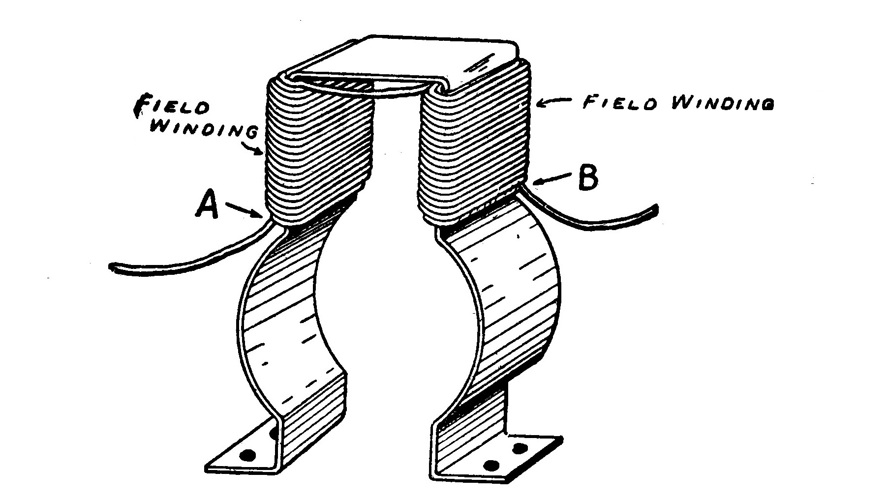
   
   FIG. 15.—The Field Frame with the Winding in position.

In order to wind the armature, cut off about seven 
feet of wire and double it back to find the center. Then 
place the wire diagonally across the center of the 
armature so that there is an equal length on both sides. 
Place a piece of paper under the wire at the crossing 
point to insulate it. Then, using one end of the wire, 
wind four layers on half of the armature. Tie the end 
down with a piece of thread and wind on the other 
half. 

The ends of the wire are cut and scraped to form the 
commutator segments. Figure 17 shows how this is 
done. 

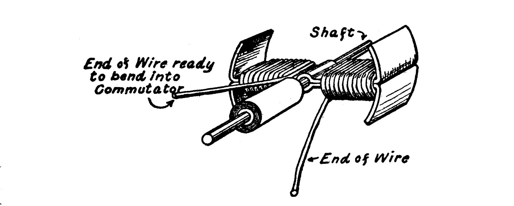
   
   FIG. 16.—The Armature Winding before the Commutator is completed.

Bend the wires as shown so that they will fit closely 
to the paper core. Bind them tightly into position 
with some silk thread. Use care so that the two wires 
do not touch each other. Cut the free ends of the wire 
off close to the core. 

When finished, the relative positions of the armature 
and the commutator should be as shown in Figure 17. 

Figure 14 shows how the motor is assembled. The 
windings are not shown for the sake of clearness. 
The armature should be exactly in the center of the 
field. The bearing holes should be in the correct 
position and should permit the armature to revolve 
freely. 

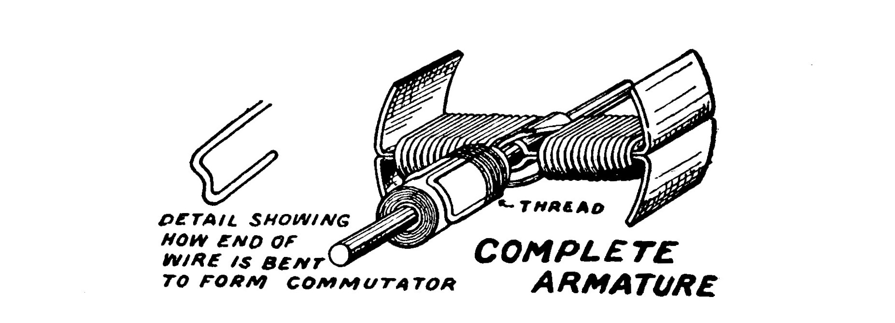
   
   FIG. 17.—The completed Armature showing how the Commutator is constructed. 

The armature should not scrape against the field at 
any point, but should clear it by about one-sixteenth 
of an inch. 

The brushes are made by flattening a piece of wire 
by a few light hammer blows. 

The brushes are fastened under a small clamp formed 
by a strip of tin held down at each end with a wood 
screw. They can be adjusted to the best advantage 
only under actual working conditions when the current 
is passing through the motor. One or two dry cells 
should be sufficient to operate the motor. 

The completed motor is shown in Figure 19. 

One end of the winding is connected to one of the 
brushes. The other brush and the other end of the 
field form the terminals to which the battery is 
connected. 

The motor, being of the two-pole armature type, 
must be started when the current is turned on, by 
giving it a twist with the fingers. 


   
   FIG. 18.—Details of the Commutator. 

Put a drop of oil on the bearings, make sure that the 
brushes bear firmly but not tightly against the 
commutator, connect the battery and your motor is ready 
to run. It will spin at a high rate of speed. 

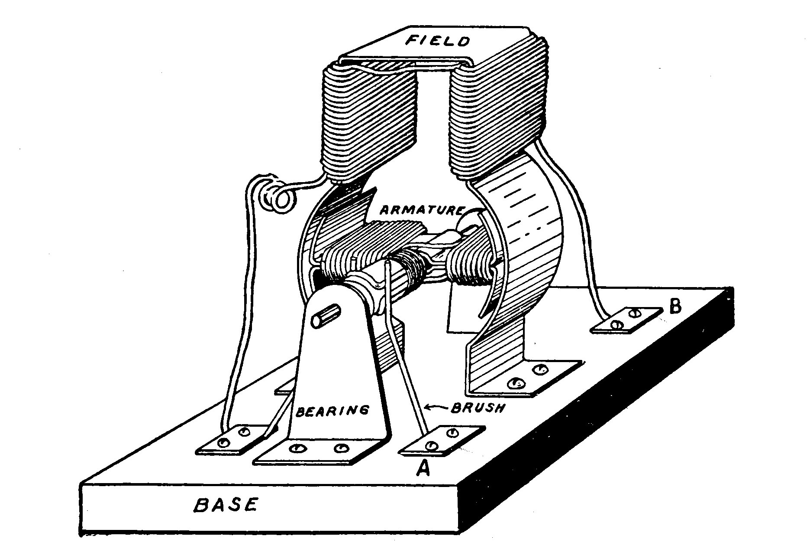
   
   FIG. 19.—The completed Motor.

SIMPLEX MOTOR WITH THREE-POLE ARMATURE.
``````````````````````````````````````` 

The form of "Simplex" motor which has just been 
described has only one drawback which prevents it 
from being a first class motor in every respect, namely, 
the armature has only two poles and the motor is 
therefore not self-starting, but must be given a twist 
with the fingers in order to start it rotating. A 
Two-pole armature is the easiest for the young experimenter 
to make and that is the reason that it has been 
described first. 

All large power motors are provided with armatures 
having a large number of poles so as to be self-starting 
and to give as steady a pull as possible. 

**The Armature**—The method of making a three-pole 
armature is practically the same as that of making one 
having only two poles. Three strips of tin, one-half 
an inch by one and one-half inches are necessary. 
They are purposely made a little longer than is actually 
required in order to form the armature and are cut to 
length after the finish of the bending operations. 

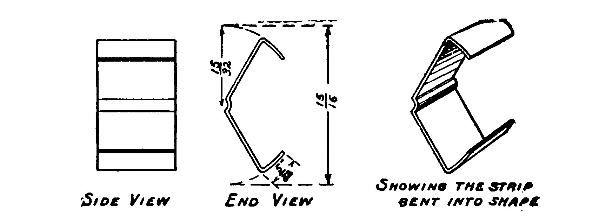
   
   FIG. 20.—Details of the Three-pole Armature.

Mark a line carefully across the center of each strip. 
Then bend them into the shape shown in Figure 20, 
taking care to keep the shape symmetrical so that all 
three pieces are exactly alike. The bend in the center 
which must fit over the shaft is most easily made by 
bending the strips over a knitting-needle and then 
bending them back the required amount. 

**The Shaft** is formed by a piece of knitting-needle, 
one and seven-eighths of an inch long. Assemble the 
three pieces, forming the armature, on the shaft as 
shown in Figure 21. Bind them temporarily together 
with a piece of iron wire and then solder them along 
the edges. The iron wire should be removed after 
they are soldered. 

**The Commutator Core** is formed by cutting a strip 
of paper, three-eighths of an inch wide and about five 
inches long. It should be given a coat of shellac on 
one side and allowed to dry until it becomes sticky. 

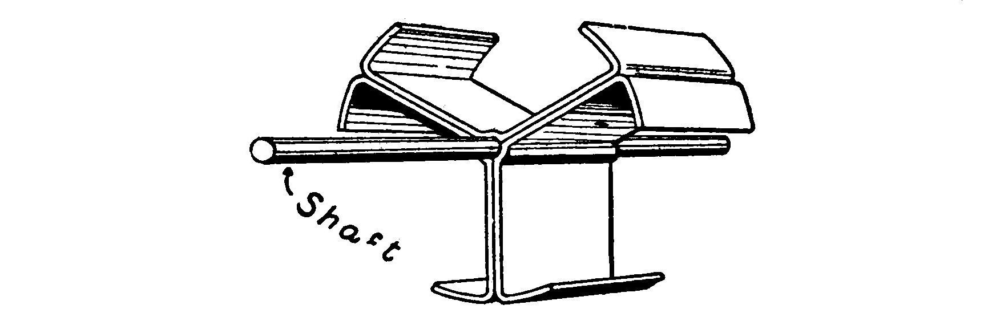
   
   FIG. 21.—The Three-pole Armature assembled on the shaft. 

The strip is then wrapped around the shaft until its 
diameter is three-sixteenths of an inch. The sticky 
shellac should be sufficient to hold the paper tightly 
in position when dry and to form a hard, firm core. 

The illustration in Figure 22 shows the position of 
the core on the shaft in relation to the rest of the 
armature. 

**The Winding of the Armature** may seem somewhat 
more difficult at first than was the case with the 
two-pole armature, but it is really very easy. The wire 
used for this purpose should be No. 25 or No. 26 B. & 
\S. Gauge, double cotton-covered. Single cotton-covered 
wire for this purpose is liable to give trouble on 
account of short circuits. 

In order to wind the armature, cut three pieces of 
wire about three and one-half feet long. Wrap a strip 
of paper around each section of the armature so that 
the sharp edges of the tin will not cut through the 
insulation on the wire and then wind four layers of wire 
on each section of the armature. 

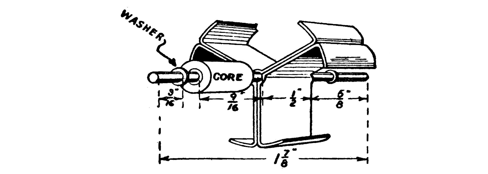
   
   FIG. 22.—Showing the Armature and Shaft with the Commutator Core in position. 

Each section should be wound in the same 
direction as the others. The ends of the wires should be 
scraped free from insulation and connected together 
as follows: Connect the outside end of one section to 
the inside end of the next section. We will presume 
that the three sections of the armature are lettered 
"A, B, and C." Connect the outside end of "A" to 
the inside of "B"; the outside of "B" to the inside end 
of "C" and the outside of "C" to the inside of "A." 

Those portions of the wire forming the connections 
between the three sections, are used to form the 
commutator segments, in the same manner as the ends of 
the wires in the case of the two-pole armature, only 
in this instance there are three sections to the armature. 

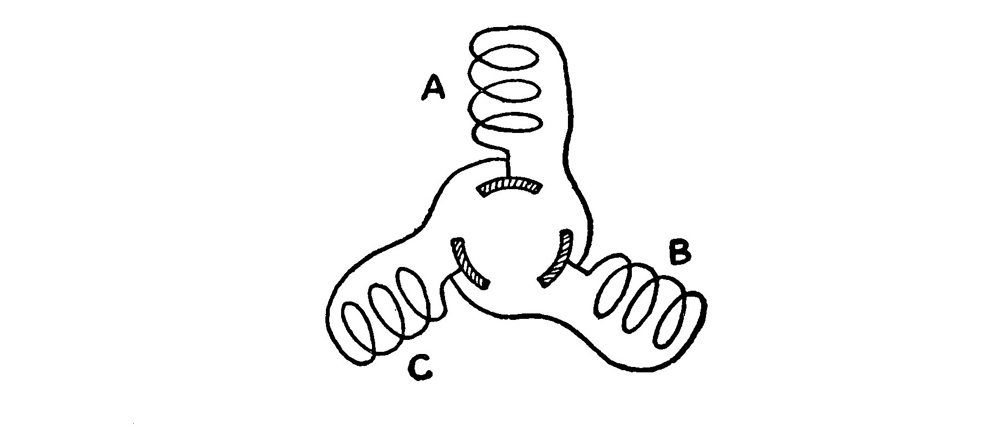
   
   FIG. 23.—Diagram showing how the coils are connected together so as to form a continuous winding.

Bend the wires so that they will fit closely to the 
paper core and bind them tightly into position with 
some silk thread. A section of the commutator should 
come opposite the space between each section of the 
armature. 

**The Field Magnet** is exactly like that used in 
making the Simplex motor with the two-pole armature. 
It is made by first cutting out a strip of tin five-eighths 
of an inch wide by five inches long and then bending 
it into the shape shown in Figures 10 and 11. The 
easiest way of doing this with reasonable accuracy is 
to cut out a piece of wood for a form and then bend 
the tin over the form. 

Two small holes should be bored in the feet of the 
field magnet so as to enable the field to be fastened to 
the base. 

The field is wound with the same size of wire used 
on the armature. The winding is started by looping 
a small piece of tape or cord over the frame at the 
point indicated by "A" in Figure 15. The next two 
turns are then wound over the ends of the loop so as 
to hold them down. Wind on three layers of wire on 
one side and then run the wire across to the other 
side and wind on three layers there. The third layer 
of wire in the second coil should end at B. It should 
be fastened in position by a loop of string so that it will 
not unwind. 

This method divides the field winding into two parts, 
both of which are connected together. The outside 
layer of the first coil is connected to the inside layer 
of the second coil. The two coils really form one 
continuous winding divided into two parts. The 
illustration in Figure 23 should make this clear. After the 
winding is finished, give it a coat of shellac. 

**The Bearings** are shown in detail in Figure 12. 
They are easily made. Care should be taken to make 
the bearings very accurate so that the armature will 
be in the proper position when the motor is assembled. 

Two small washers, serving as collars to bear against 
the inside of the bearings and keep the armature in the 
field should be soldered to the shaft as shown in 
Figure 13. 

**The Base** is cut from any ordinary piece of wood 
and should be in the form of a rectangular block about 
two and one-half inches by one and seven-eighths 
inches wide, and one-half inch thick. 

The completed motor is shown in Figure 24. Be 
sure that the armature does not scrape against the 
field at any point but clears it by about one-sixteenth 
of an inch all around. The brushes are fastened under 
a small clamp made from a strip of tin held down at 
each end by a small wood screw. The brushes are 
made by flattening the end of a piece of copper wire 
with a few light hammer blows. The brushes can be 
best adjusted under actual working conditions when 
the current is passing through the motor. 

One end of the field winding is connected to the 
brush marked "C," in Figure 24. The other brush, 
"A" and the other end of the field winding, "B," form 
the terminals to which the battery is connected. This 
forms what is known as a series connected motor, 
because the armature and the field are in series and the 
current must pass from one to the other. 

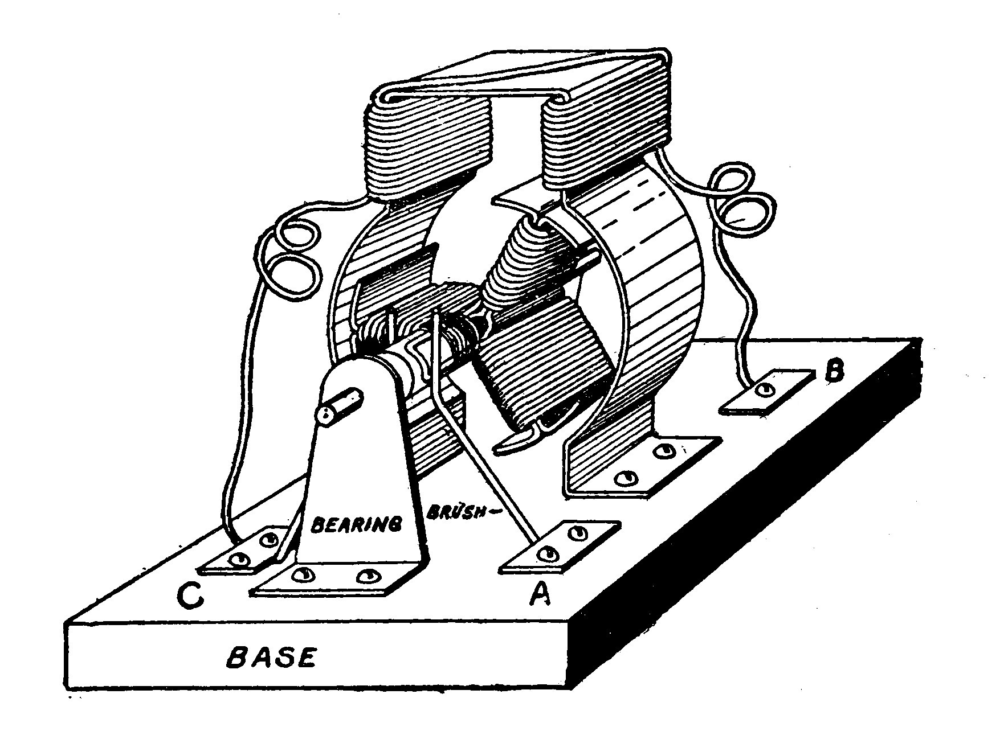
   
   FIG. 24.—The completed Three-pole Motor. 

After you have finished assembling the motor, put 
a drop of oil on the bearings, make certain that the 
brushes are properly adjusted, connect the battery, 
and your motor is ready to run. One or two dry cells 
should furnish sufficient current to run the motor at 
high speed. 

HOW TO MAKE THE SIMPLEX OVERTYPE MOTOR.
``````````````````````````````````````` 

The method of construction which has been 
outlined in making the two Simplex motors, just described, 
also lends itself to the construction of many other 
simple and interesting forms of motors. 

Figure 25 shows a form of motor which is essentially 
the same as that shown in Figure 24 except that the 
field has been turned upside down and the armature 
is at the top of the motor instead of the bottom. 

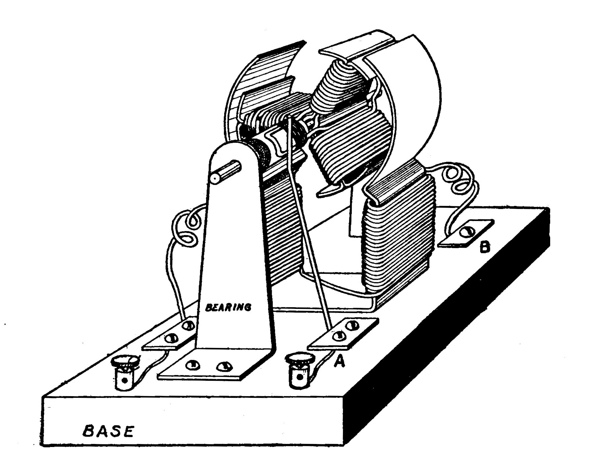
   
   FIG. 25.—The Simplex "Overtype" Motor. 

The detailed dimensions of the field are shown in 
Figure 26. It is made by cutting out a. strip of tin 
five-eighths of an inch wide and five inches long. 
This strip is then bent into the shape shown in Figures 
26 and 27. This form of field is really very similar to 
that shown in Figure 15 except that the two feet are 
omitted and it has been turned upside down. The 
method of making ft is the same. 

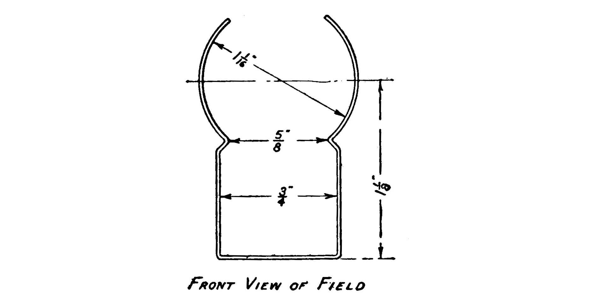
   
   FIG. 26.—Details of the Field Frame for the "Overtype" Motor. 

The field should be wound with either No. 25 or No. 
26 B. & S. Gauge double cotton-covered wire. It 
should be carefully prepared for winding by a strip of 
shellaced paper around each of the two straight parts 
of the field magnet where the winding is to be placed. 
Then proceed with the winding in exactly the same 
manner as in the case of the field shown in Figure 15. 

The armature used is of the the three-pole type and 
is exactly the same as that shown in Figures 20, 21 
and 22. 

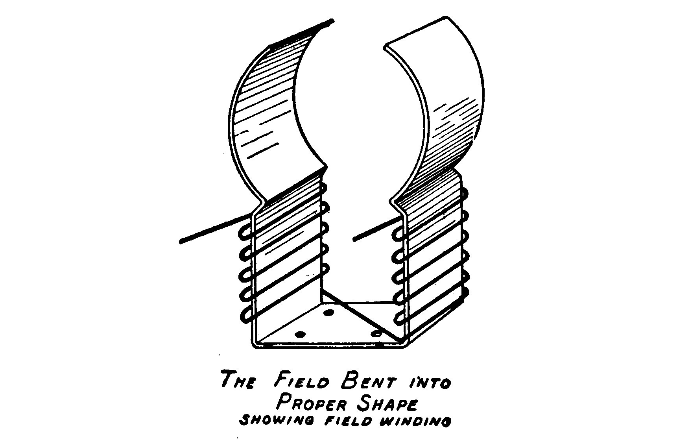
   
   FIG. 27.—Showing how the Field is Wound. 

The bearings will have to be made much higher on 
account of the armature being higher than the base.
The details of the bearings are shown in Figure 28. 
They are cut out of sheet tin. Care should be taken to 
make them accurately so that the armature will be in 
the proper position when the motor is assembled. 

The base is a block of wood two and one-half inches 
long, one and seven-eighths of an inch wide and 
one-half inch thick. 

The field is fastened to the base by four small wood 
screws. The exact method of assembling the motor 
is probably best understood by studying the 
illustration in Figure 25. 

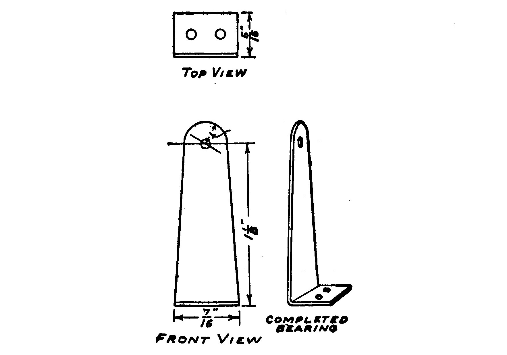
   
   FIG. 28.—The Bearings.

THE MANCHESTER MOTOR. 
`````````````````````

Those readers who have made the motors already 
described, are no doubt anxious to proceed with the 
construction of some models which bear a greater 
resemblance to the large motors commonly employed to 
furnish power. 

Figure 29 shows a motor of the "Manchester" type. 

**The Field** of this machine is made from a strip of 
heavy sheet tin, one-half inch wide and about six inches 
long, bent to shape and joined in the center of the 
bottom pole piece, just above the pedestal. It is best 
to cut the strip a little long and then reduce it to the 
exact length required after the bending operations have 
been finished. The illustration in Figure 30 shows the 
details and dimensions of the field. 

The field should be bent into shape with the aid of 
a pair of pliers and a wooden form, in the same manner 
employed in making the motors already described. 

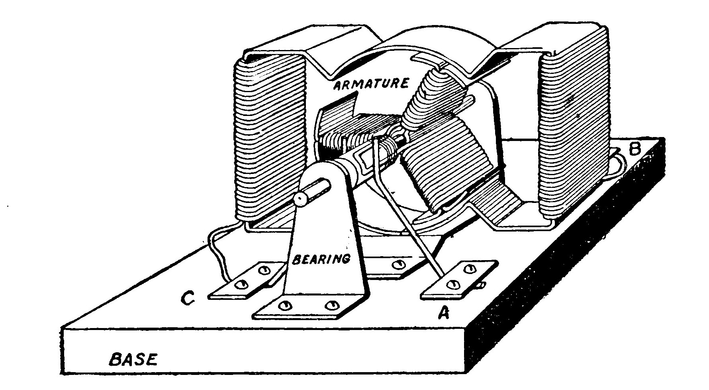
   
   FIG. 28.—The Manchester Motor.

The field frame is supported by a "pedestal." The 
pedestal is formed by another strip, one-half inch wide, 
soldered to the field at right angles, underneath the 
joint in the lower pole piece. 

The pedestal should be firmly soldered to the field, 
care being taken to see that the solder runs well into 
the joints. Then bend the ends of the pedestal down to 
form two "feet" as shown in the illustration. The 
feet should be bent so as to bring the center of the 
armature tunnel five-eighths of an inch above the base. 

Two small holes should be bored in the pedestal, at 
each side, so that the motor can be screwed fast to a 
wooden base. 

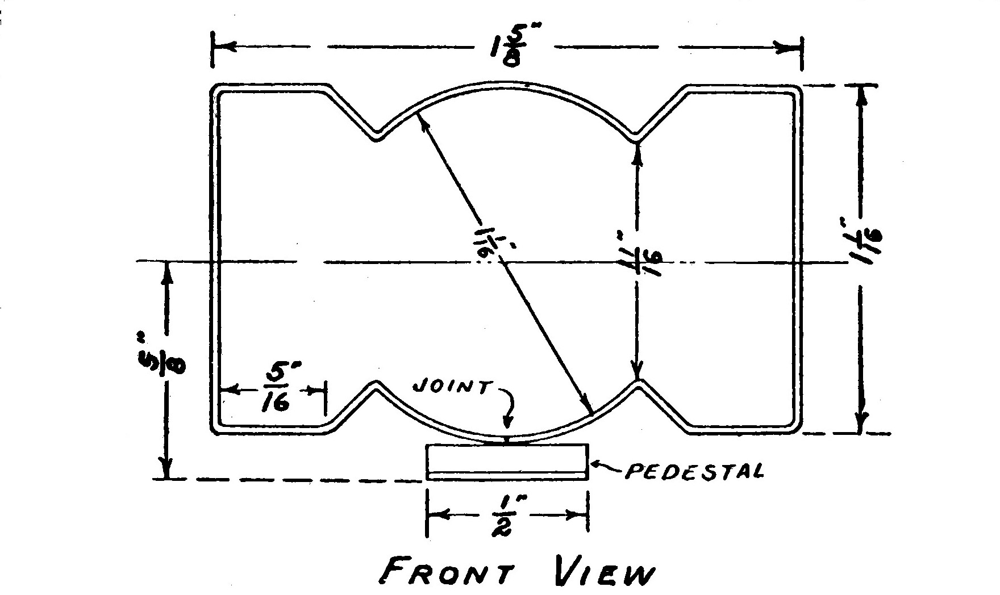
   
   FIG. 30.—Details of the Field Frame. 

**Winding the Field**—It will be necessary to proceed 
with the winding of this motor in a slightly different 
manner from that followed in making the other motors. 
The wire cannot be wound on as easily as before and 
it will be necessary to wind the required length of wire 
onto a small spool or bobbin, which can be passed 
through the field. Double cotton-covered wire is the 
best for the purpose. Either No. 25 or No. 26 B. & S. 
Gauge may be used. A strip of paper should be 
wrapped around the field frame at all points where the 
wire is liable to touch, so as to guard the insulation 
against possible abrasion. 

Figure 32 shows the method which should be 
followed in winding the coils. Both parts of the winding 
should be started at the bottom of the field and wound 
in the direction indicated. "B" and "D" are the 
starting ends Wind on three layers of wire in each coil. 
The terminals, "B" and "C," should be connected 
together after the winding is finished. 

**The Armature**—The method of making the armature 
is exactly the same as that which has already been 
described. Three strips of tin, one-half inch wide and 
one and one-half inches long are required. They are 
purposely made slightly longer than is actually 
necessary and are cut to length after the finish of the 
bending operations. 


   
   FIG. 31.—Details of the Field Pedestal. 

Mark a line carefully across the center of each of
the three strips and then bend them into the shape 
shown in Figure 20, making certain to keep the shape 
symmetrical so that all three, pieces are exactly alike. 
The bend in the center of each strip should fit nicely 
over the shaft. This result is most easily reached by 
bending the strips over a knitting-needle and then 
bending them back the required amount. 

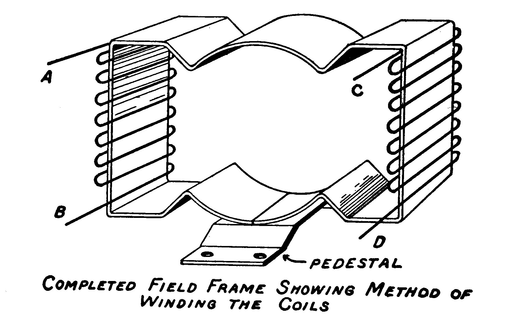
   
   FIG. 32.—Showing how the Field Coils are Wound. 

**The Shaft** is a piece of knitting-needle one and 
seven-eighths of an inch long. Assemble the three strips on 
the shaft as shown in Figure 21 and bind them 
temporarily together with a piece of iron wire. Then 
solder the edges together and remove the wire. 

**The Commutator Core** is formed of a strip of paper, 
three-eighths of an inch wide and about five inches 
long, wrapped around the shaft until the diameter of 
the small cylinder thus formed is three-sixteenths of 
an inch. The paper strip should be given a coat of 
shellac on one side and allowed to dry until it 
becomes sticky before it is wrapped around the shaft. 
The sticky shellac should be sufficient to hold the 
paper tightly in position when dry and to form a hard, 
firm core when dry. 

**The Winding of the Armature** is not difficult. The 
size of the wire used should be No. 25 or No. 26 B. & 
\S. Gauge, double cotton-covered. 

Wrap a strip of paper around each section of the 
armature so that the wire will be protected from any 
sharp edges on the tin which might cut through the 
insulation. 

Wind four layers of wire on each section of the 
armature. Each section should be wound in the same 
direction as the others. The terminals of the wires 
should be scraped clean and connected together in the 
following manner: Connect the outside end of one 
section to the inside end of the next section. We will 
presume that the three sections of the armature are 
lettered "A", "B" and "C." Connect the outside end of 
"A" to the inside of "B"; the outside of "B" to the 
inside end of "C" and the outside end of "G" to the 
inside of "A." 

The portion of the wires forming the connections 
between the three armature coils are used to form the 
three sections of the commutator. 

Bend the wires so that they will fit closely to the 
paper core and bind them tightly into position with 
silk thread. 

**Two Bearings** are required to support the armature. 
They are cut out of sheet iron or brass and are shown 
in detail in Figure 12. Extra care should be exercised 
in making the bearings to insure their accuracy so that 
the armature will be in the proper position when the 
motor is assembled and run freely. 

Two small washers or wire rings, to serve as collars 
and keep the armature in the center of the field, should 
be soldered to the shaft as shown in Figure 22. 

**The Base** is a square block of wood, two and 
one-half inches wide, two and one-half inches long and 
three-eighths of an inch thick. 

The completed Manchester motor is shown in Figure 
\29. The brushes are made by flattening the ends of 
two pieces of copper wire. Each brush is fastened 
under a small clamp made from a strip of tin held down 
at each end by a small round-headed wood screw. 

Be sure that the armature is exactly in the center of 
the field, does not scrape at any point and turns 
perfectly freely. 

The armature and the field windings should be 
connected in series. The terminals of the field marked 
"B" in Figure 32 should be connected to the brush 
clamp marked "C" in Figure 29. The terminal of the 
field marked "C" in Figure 32 forms one terminal of 
the motor. The other is the brush clamp "A." 

Oil the bearings of the motor, adjust the brushes and 
it will be ready to run. 

CHAPTER III. A Magnetic Attraction Motor. A Motor Having a Laminated Field and Armature Frame. How to Make an Experimental Induction Motor. How to Make an Electric Engine.
---------------------------------------------------------------------------------------------------------------------------------------------------------------------------

A MAGNETIC ATTRACTION MOTOR. 
````````````````````````````

This motor differs from those which have already 
been described, in that no wire is wound on the 
armature. 

**The Field Coils** consist of two electro-magnets 
wound upon iron cores one and one-eighth inches long 
and five-sixteenths inches in diameter. Each core is 
fitted with two fibre heads, one-sixteenth of an inch 
thick and seven-eighths of an inch in diameter so as 
to form a bobbin as shown in Figure 33. The bobbins 
are wound with No. 22 B. & S. Gauge single 
cotton-covered magnet wire. The magnets are connected in 
series so that the current flows through them in 
opposite directions. 

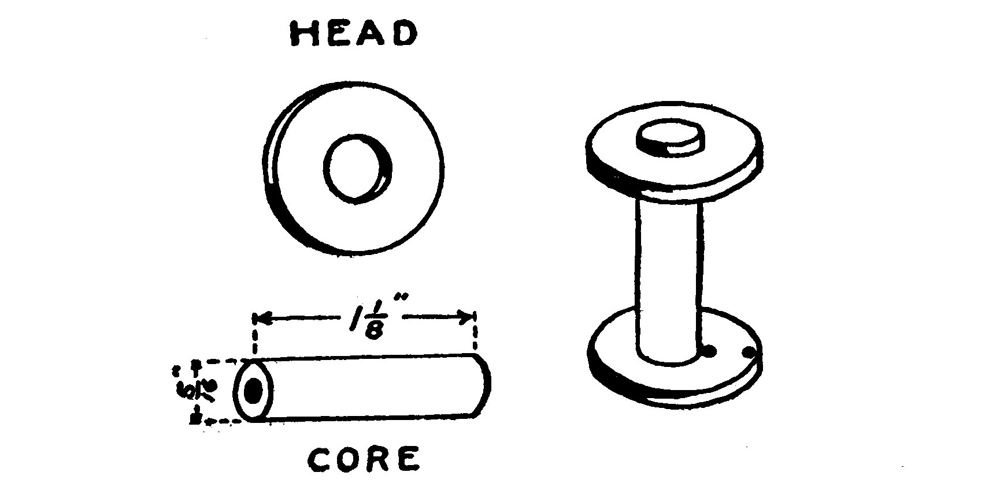
   
   FIG. 33.—Details of the Magnet Bobbins. 

**The Armature** is a strip of soft iron one and 
three-quarters inches long, three-eighths of an inch wide 
and three thirty-seconds thick. A one-eighth inch hole 
bored through the center of the armature and the latter 
forced upon a shaft one and seven-eighths inches long. 

The lower end of the shaft is pointed and rests in a 
small hole in the magnet yoke, half way between the 
two coils. 

The magnet-yoke is a strip of soft Iron or steel two 
and one-half inches long, seven-eighths inches wide 
and one-eighth of an inch thick. 


   
   FIG. 34.—The completed Electromagnets mounted on the Yoke. 

The magnets are mounted on a wooden base, five 
inches long, three inches wide and three-eighths of an 
inch thick, by means of two 8-32 machine screws which 
pass upward from the bottom of the base into the 
bottom of the magnets. The yoke is placed under the' 
magnets, between them and the base. The screws pass 
through two holes, one and one-eighth inches apart. 

The armature is supported in position over the 
electromagnets by means of a standard bent out of a 
strip of sheet brass. The details of the standard are 
shown in Figure 36. The standard is fastened to the 
base by means of two small wood screws. 


   
   FIG. 35.—Details of the Armature Shaft. 

The armature should just clear the top of the 
electromagnets when the lower end of the shaft is resting in 
the socket in the yoke. The shaft should be perfectly 
vertical and revolve freely without friction. 

The lower end of the shaft carries a small brass 
contact which is forced into position. The exact shape 
and dimensions of this contact are shown in Figure 37. 
The holes through the center should be slightly smaller 
than the diameter of the shaft, so that when the contact 
is forced into position it will remain secure and not 
move. 

**The Brush** which bears against the contact is 
illustrated in Figure 38. This is cut out of spring copper 
or brass and made according to the shape and 
dimensions shown in the illustration. The brush is fastened 
to the base by means of a round-headed brass wood 
screw. 

The proper method of assembling the motor and its 
appearance when finished are best understood from the 
illustration in Figure 39. 


   
   FIG. 36.—Details of the Standard which forms the upper bearings.

**The Binding Posts** consist of machine screws 
provided with hexagonal nuts and thumb screws, such as 
that supplied on dry batteries. One binding post 
passes through the end of the brush and connects with 
it. The other binding post is mounted at the left 
hand forward corner of the base. One terminal of 
the electromagnets leads to this binding post. The 
other terminal is placed under the head of one of the 
screws which hold the standard to the base. 


   
   FIG. 37.—The Brass Contact. 

The contact and the brush will have to be most 
carefully adjusted before the motor will run. The tip 
of the contact should make contact with the brush 
just before the armature starts to swing over the 
electromagnets and break the circuit just as the 
armature is actually over. The exact position will have to 
be found by a little experimenting. It is very 
necessary that the brush should be so adjusted that it only 
touches the ends of the contact as it swings around. 


   
   FIG. 38.—The Brush which bears against the Contact. 

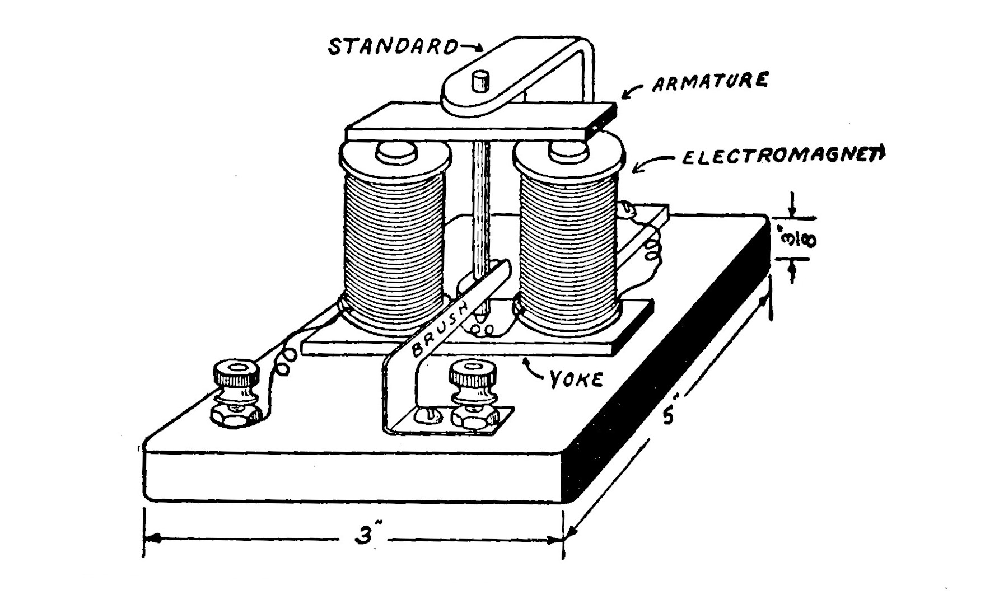
   
   FIG. 39.—The completed Magnetic Attraction Motor. 

The operation of the motor is very simple. When 
a battery is connected to the binding posts the circuit 
is not complete so that the coils are magnetized and 
can attract the armature until the contact touches the 
brush. When the contact and the brush touch, 
however, the circuit is completed and the armature will 
be drawn toward the electromagnets. As soon as it 
reaches a position over the ends of the cores, the 
circuit should be broken so that the momentum will 
carry the armature past and around into such position 
that the opposite end of the contact touches the brush 
and the operation is repeated. 

A magnetic attraction motor of this type will usually 
have to be started by giving the shaft a twist with the 
fingers. 

HOW TO CONSTRUCT A MOTOR HAVING A LAMINATED ARMATURE AND FIELD FRAME 
````````````````````````````````````````````````````````````````````

It is an easy matter to make a strong electric motor 
suitable to operate on batteries by the exercise of a 
little careful workmanship. 

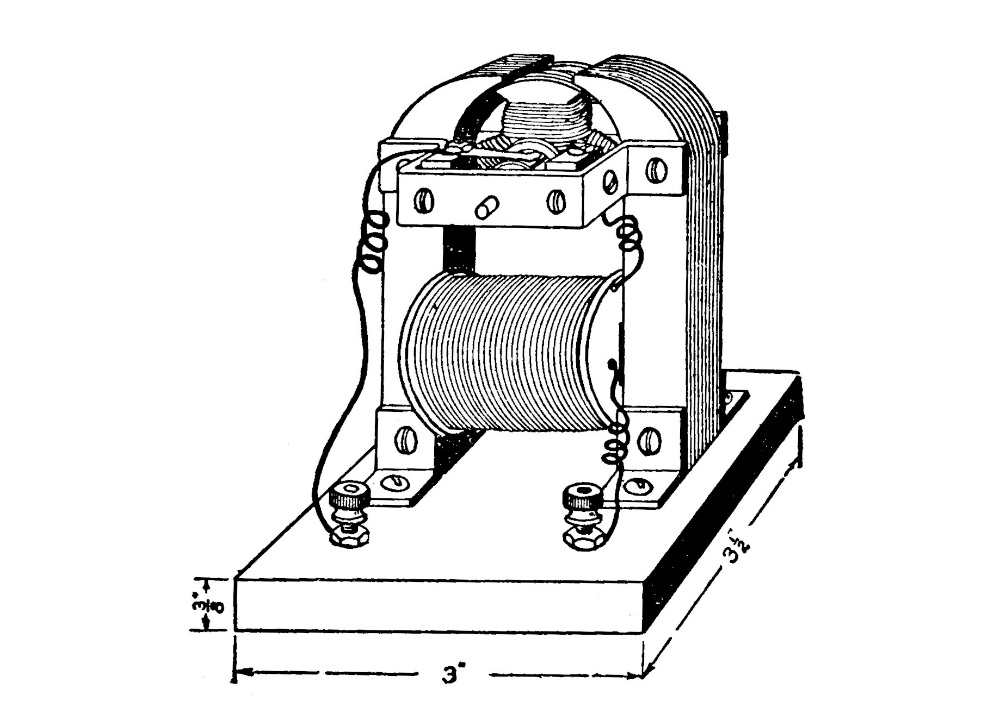
   
   FIG. 40.—The completed Electric Motor. 

The field frame and armature of the motor shown in 
Figure 40 are laminated, that is, built up of separate 
sheets of iron. They may be made out of sheet tin or 
ordinary stove pipe iron. The cheapest and simplest 
method of securing good flat material is to get some 
old scrap from a tinner’s or plumbing shop. 

**The Details of the Field** are shown in Figure 41. 
The exact shape and dimensions can be understood by 
reference to the illustration. Lay out one lamination 
very carefully as a pattern. Cut it out and smooth up 
the edges, making certain that it is perfectly true to 
size and shape. Then use it as a template to lay out 
the other laminations by placing it on the metal and 
scribing a line around the edges with a sharp pointed 
needle. Enough laminations should be cut out to 
make a pile five-eighths of an inch high when tightly 
pressed together. 

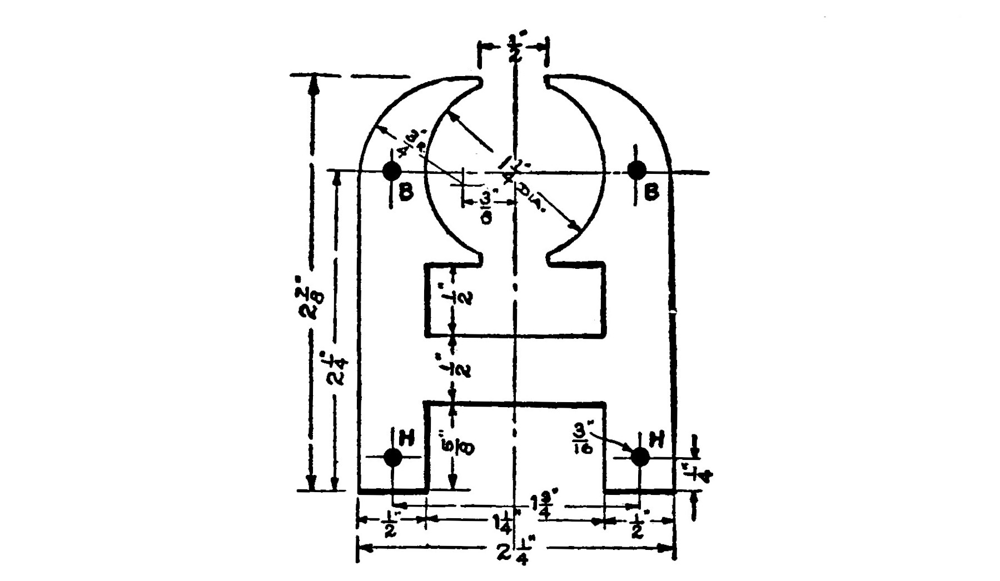
   
   FIG. 41.—Details of the Field Frame. 

**The Armature** is made in exactly the same manner 
as the field frame, that is, by cutting out a pattern 
according to the shape and dimensions shown in Figure 
43 and using it as a template to lay out the other 
laminations. Enough should be cut to make a pile 
five-eighths of an inch high when tightly squeezed together. 

The armature is one and three-sixteenths inches in 
diameter. The hole in the field frame which 
accommodates the armature is one inch and one-quarter in 
diameter so that there is a space in between for the 
armature to revolve in. 

The hole through the center for the shaft should be 
of such diameter that the laminations will force very 
tightly on a shaft one-eighth of an inch in diameter. 
The laminations should be very carefully flattened and 
then forced over the steel shaft which is two and 
one-eighth inches long. Clean up all the rough edges with 
a file and smooth the outside so that it will revolve 
properly in the field without scraping. 

Figure 44 illustrates the armature assembled on the 
shaft and ready to be wound. 

**The Armature Windings** consist of four layers of No. 
22 B. & S. Gauge double cotton covered magnet wire 
wound around each leg. The iron should be very 
carefully insulated with shellaced paper before the wire 
is put in position so that there will not be any danger 
of short circuit due to the sharp edges of the metal 
cutting through the insulation. Each leg should 
contain the same number of turns of wire and all should 
be wound in the same direction. 

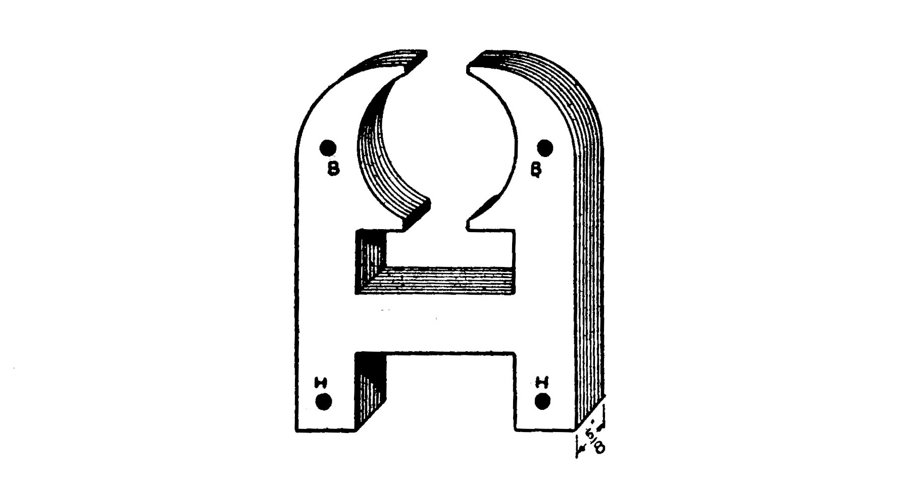
   
   FIG. 42.—The Assembled Field ready for Winding. 

**The Commutator** is illustrated in Figure 45. It 
consists of a piece of brass tubing seven-sixteenths of an 
inch long, five-sixteenths inside and three-eighths of 
an inch outside. It should be forced onto a piece of 
fibre five-sixteenths of an inch in diameter and 
seven-sixteenths of an inch long. Split the tube, into three 
equal parts by dividing it longitudinally with a 
hacksaw. Make a fibre ring which will force onto the tube 
very tightly when it is in position on the fibre core 
and so hold the three commutator sections firmly in 
position. The sections should be arranged so that 
there is a small space between each two and they are 
perfectly insulated from each other. The fibre core 
should have a one-eighth inch hole through the center 
so that it may be forced tightly onto the shaft and up 
against the armature after the windings are in position. 
The commutator should be in such a position that the 
split between each two sections comes directly opposite 
the centre of each winding. Suppose that the windings 
are lettered "A", "B", and "C", the commutator section 
between "A" and "B" is numbered 1, that between 
"A" and "C" is No. 2, and the one between "C" and 
"B" is No. 3. Then the inside terminal of "B" is 
connected to the outside terminal of "A" and soldered to 
the end of commutator section No. 1 close to the 
winding. The inside end of "B" is connected to the outside 
terminal of "C" and to commutator section No. 2. 
The inside end of winding "C" is connected to the 
outside of "B" and to commutator section No. 3. The 
connection of the armature windings to the 
commutator are represented by the diagram in Figure 45. 

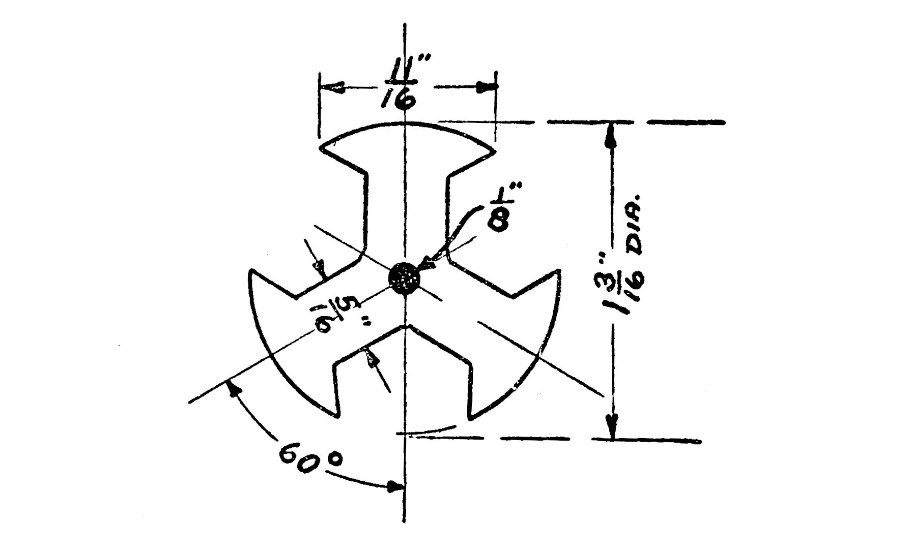
   
   FIG. 43.—Details of the Armature Laminations. 

**The Field Winding** consists of five layers of No. 18 
\B. & S. double cotton covered wire. A much neater 
job may be made of this part of the work if two fibre 
heads are cut to slip over the field and support the 
ends of the winding as shown in the illustration in 
Figure 40. 


   
   FIG. 44.—The Armature assembled on the Shaft ready to Wind. 

**The Bearings** are illustrated in Figure 46. They are 
made out of three-eighths inch brass strip 
one-sixteenth of an inch thick by bending and drilling as 
shown in the illustration. The location of the holes is 
best understood from the drawing. The larger 
bearing is assembled on the field at the side towards the 
commutator. 

Assembling the motor is a comparatively easy matter 
if it is done properly and carefully. The bearings are 
mounted on the field frame by screws passing through 
the holes "B" and "B" into a nut on the outside of the 
bearing at the opposite side of the field. 

The armature should revolve freely without binding 
and without any danger of scraping against the field. 
Slip some small fibre washers over the ends of the 
shaft between the armature and the bearings so as to 
take up all end play. 

**The Brushes** are made of spring copper according 
to the shape and dimensions shown in Figure 47. They 
can be cut out with a pair of snips. 

Each brush is mounted on a small fibre block 
supported on the large motor bearing. The holes marked 
"A" and "C" in the illustration should be threaded with 
a 4-36 tap. The hole "B" should be made one-eighth 
of an inch in diameter and drilled all the way through 
the block. 

The holes, "A" and "C" are used to fasten the blocks 
to the bearing. The brushes are fastened to the blocks 
by means of a 6-32 screw with a nut on the lower end. 

**The Base** is a rectangular block, three inches wide, 
three and one-half inches long and three-eighths of an 
inch thick. The motor is fastened to the base by four 
small right angled brackets bent out of strip brass and 
secured to the field frame by two machine screws 
passing through the holes, "H" and "H", into a nut at the 
opposite end. 

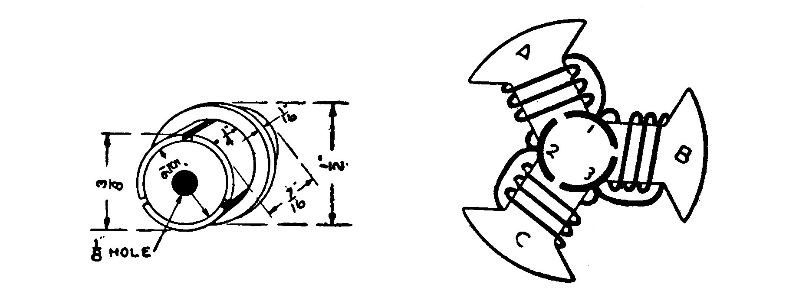
   
   FIG. 45—The Commutator and Method of connecting the Armature Coils. 

One terminal of the field winding is connected to a 
binding post mounted on the base. The other terminal 
of the field is connected to the right hand brush. The 
end of the wire should be placed under the head of the 
screw which holds the brush to the fibre block. The 
brush should be on the under side of the block so that 
it bears against the under side of the commutator. 

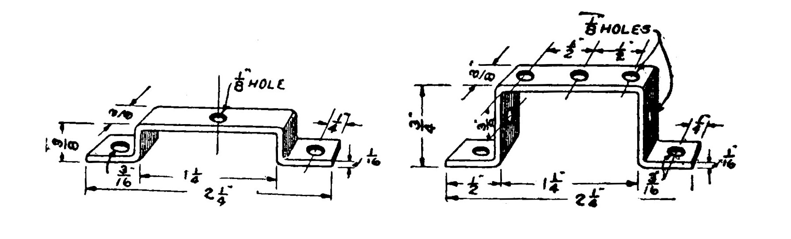
   
   FIG. 46.—The Bearings. 

The left hand brush bears against the upper side of 
the commutator and is connected to a second binding 
post on the base of the motor. This makes it a "series" 
motor, that is, the armature and the field are connected 
in series. 

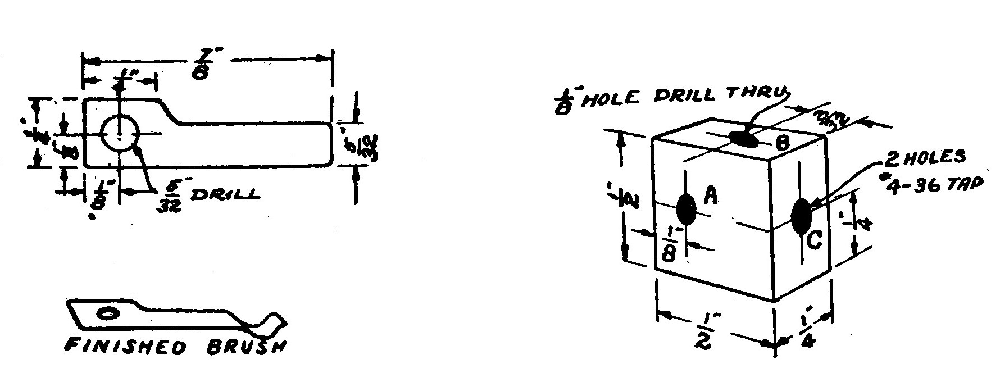
   
   FIG. 47.—Brush and Supporting Block. 

The motor is now ready to run. Put a drop of oil 
on each bearing and make certain that the curved 
portion of the brushes bear firmly against the centre of the 
commutator on opposite sides. The armature having 
three poles, should start without assistance and run at 
high speed as soon as the current-is applied. Two cells 
of dry or other battery should be sufficient. The 
motor may be fitted with a small pulley so that its power 
may be utilized for driving small models. 

HOW TO MAKE AN EXPERIMENTAL INDUCTION MOTOR. 
````````````````````````````````````````````

A motor having a three-pole armature will run 
on alternating current as well as on direct current 
and can be operated on the 110 volt A. C. current in 
series with a suitable resistance. The average 
experimenter is probably aware of this but did you know that 
it can also be operated on alternating current as an 
**induction motor** and that it will then run **without brushes**
and without current being led into the armature? 

In order to make an induction motor out of an 
ordinary three-pole battery motor such as that shown 
in Figure 48 it is merely necessary to remove the 
brushes and bind a piece of bare copper wire around 
the commutator so that it short circuits the segments. 

The alternating current should be led into the field 
coil. A step down transformer will prove very useful 
for producing a low voltage alternating current which 
may be connected directly to the field coil. If a 
transformer is not available, the 110 v. alternating current 
can be used, provided that a proper resistance such 
as a lamp bank, be placed in series with the motor. 

If the current is turned on and the armature is then 
speeded up by giving it a couple of sharp twists, or 
winding a string around the shaft and then pulling it 
as one would spin a top, the motor will continue to 
revolve at a good rate of speed. 

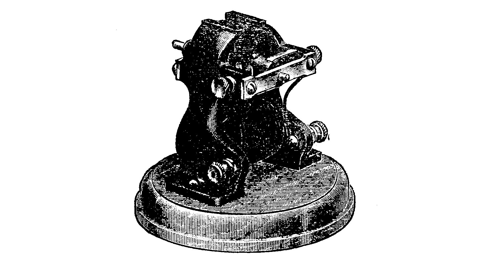
   
   FIG. 48.—A well known Three-pole Battery Motor. 

It may prove easier to start the motor if the 
armature is speeded up before the current is turned on. 
As soon as a good speed is reached, turn on the 
current and the armature should continue to run. 

Commercial induction motors are self starting, and 
are provided with a hollow armature, which contains 
a centrifugal governor. When the motor is at rest 
or starting, four brushes press against the commutator 
and divide the armature coils into four groups. After 
the motor has attained the proper speed the governor 
is thrown out by centrifugal force and pushes the 
brushes away from the commutator. At the same time 
a metal ring is pressed against the interior of the 
commutator, short circuiting all the sections and making 
each coil a complete circuit of itself. 

It would be very difficult to provide a small 
three-pole toy motor with such a governor and 
short-circuiting device in order to make it self-starting. 

It is however possible to accomplish this in another 
way, by a very simple device. 

This consists in providing the armature with 
another set of coils for use in starting only. The brushes 
are allowed to remain on the motor but are only used 
for starting. The leads of the armature winding are 
removed from the commutator and are all connected 
together. Then two or three layers of wire are wound 
over the coils to form new coils which are similar to 
the old ones but smaller. 

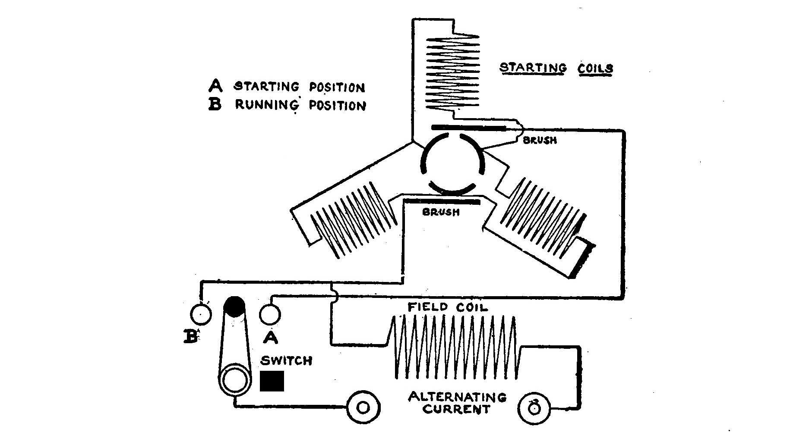
   
   FIG. 49.—Showing how a Three-pole Motor may be provided with "Starting Coils" and connected to form an Experimental Induction Motor. 

These new coils are connected to the commutator 
in the same way as the old ones were before being 
removed, just as if the motor was to be used in the 
ordinary manner. 

A two-point switch will be necessary in order to 
complete the arrangements. The connections should 
be made as in Figure 49. The switch should be thrown 
to the right, on contact A, for starting so that the 
current flows through the field and through the extra 
coils on the armature in the ordinary way. As soon 
as the motor has reached its speed, throw the switch 
to the left so that the current flows through the field 
only and the motor will continue to run by induction. 

HOW TO BUILD AN ELECTRIC ENGINE 
```````````````````````````````

An electric engine is really a form of electric motor 
but differs from the most common form of the latter 
in that the armature, instead of revolving, oscillates 
back and forth, like the piston of a steam or gasoline 
engine. Electric engines are not as efficient as electric 
motors from the standpoint of the amount of power 
delivered in proportion to the current used, but they 
make very interesting models and the young 
experimenter will derive fully as much pleasure in 
constructing one as from the construction of an electric motor. 

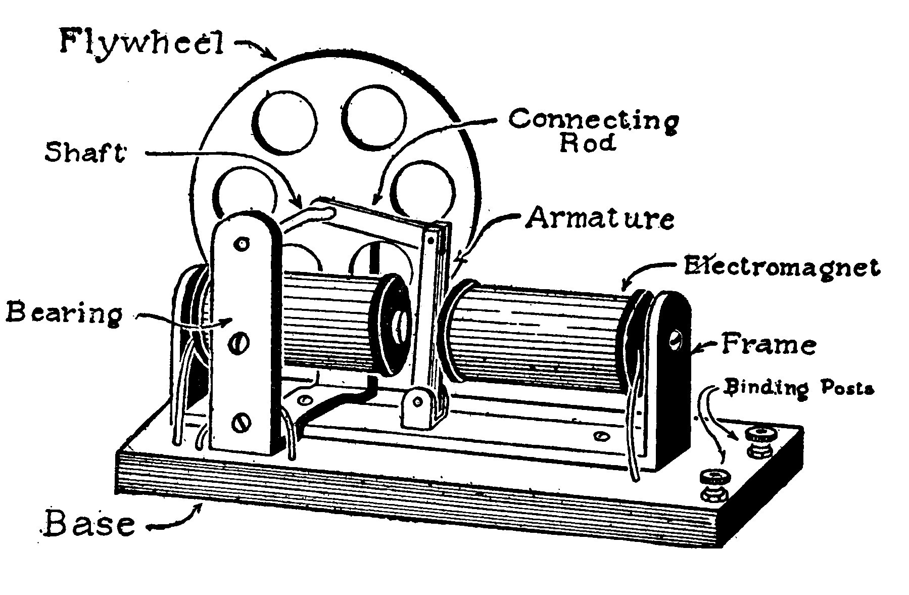
   
   FIG. 50.—The completed Engine.  

Various forms of electric engines were made before 
the first practical electric motor was invented. They 
amounted to little more than curiosities however, and 
could only be used where the expense of electric 
current was not to be regarded. 

The engine illustrated in Figure 50 is of the double 
action type. It is provided with two electromagnets 
arranged so that one pulls the armature forward and 
the other pulls it back. The motion of the armature 
is transmitted to the shaft by means of a connecting 
rod and crank. It is very simple to build and the 
design is such that it will operate equally well whether 
it is made large or small. If you do not happen to 
have all the necessary materials to build an engine 
according to the dimensions shown in the drawings, 
you can make it just one-half that size, and it will 
work equally well although it will, of course, not give 
as much power. 

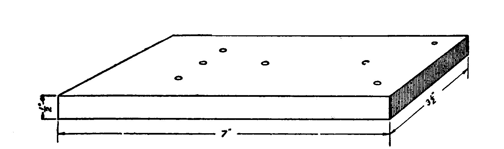
   
   FIG. 51.—The Base.

The complete engine is shown in Figure 50. All the 
various parts have been marked so that you can easily 
identify them in the other drawings. It is well to 
study this illustration carefully so that you will 
understand just how all the parts are arranged. 

**The Base** is illustrated in Figure 51. It is made of 
a piece of hardwood, seven inches long, three and 
one-half inches wide, and one-half an inch thick. 

**The Electromagnets** will largely determine the 
dimensions of the rest of the engine. The magnets 
shown in Figure 52 are made of three-eighths inch 
round iron two and one-half inches long, provided 
with two fibre washers one and one-eighths inches in 
diameter. On end of each of the steel cores is drilled 
and tapped to received an 8-32 screw. The 
experimenter may possibly be able to secure some old 
magnet cores fitted with fibre heads from an old 
telephone bell or "ringer" as they are sometimes called. 
A suitable bolt may be made to serve the purpose by 
cutting it off to the right dimensions with a hack saw. 
If a drill and tap are not available for drilling and 
tapping the end so that the core can be properly 
mounted in the frame of the engine, it is possible, to 
use the threaded portion of a bolt to good advantage, 
by the exercise of a little ingenuity. The hole in the 
frame should then be made larger so that the end of 
the bolt will slip through, instead of an 8-32 screw and 
the core clamped in position by a nut on each side. 

The fibre washers are spaced two and one-sixteenth 
inches apart. The space in between should be wound 
full of No. 18 B. & S. Gauge cotton covered magnet 
wire. Before winding in the wire, cover the core with 
a layer of paper so that the wire does not touch the 
metal. The ends of the wire should be led out through 
small holes in the fibre heads. 

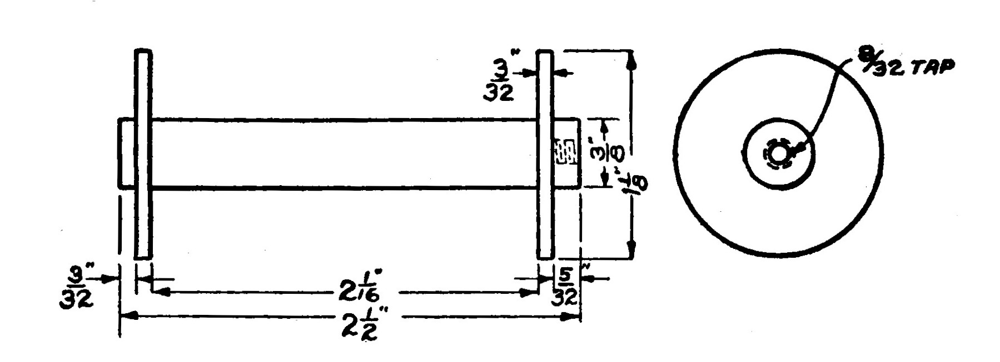
   
   FIG. 52.—Details showing the size of the Magnet Bobbin. 

It is not absolutely necessary to use No. 18 B. &.S. 
Gauge wire in winding the magnets, but it is the size 
which will give the best results on the average battery. 
If you use larger wire, the engine will require more 
current from the battery. If you use finer wire, a 
battery of higher voltage will be necessary. The 
current consumption will, however be less. 

The electromagnets are mounted in the frame of the 
engine by means of two screws passing through the 
holes E and D. The details of the frame are 
illustrated in figure 53. It is made of a strip of wrought 
iron or cold rolled steel, five and five-eighths inches 
long, an inch and one-eighth wide and one-eighth inch 
thick. 

The material for making this part of the engine and 
also the bearings can best be obtained at some 
blacksmith shop or hardware store. Heavy galvanized 
iron can be used but it is not usually thick enough, and 
it may be necessary to use two thicknesses. The ends 
of the strip are rounded and bent at right angles so 
as to form a U-shaped piece with sides one and 
three-quarters inches high. 

The holes, "D" and "E", should be large enough to 
pass an 8-32 screw. The holes, "A", "B" and "C" 
should be about one-eighth of an inch in diameter. 
They are used to pass the screws which hold the frame 
of the engine to the wooden base. 

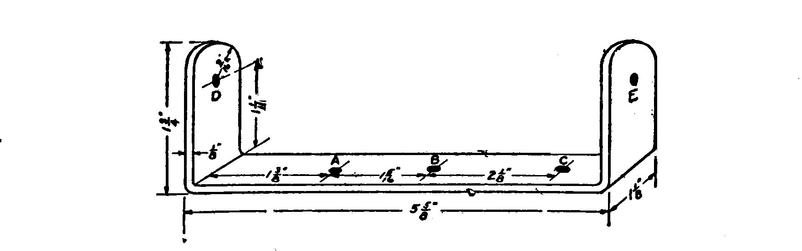
   
   FIG. 53.—The Frame which supports the Electromagnets. 

**The Bearings** are shown in Figure 54. They are 
made U-shaped and are out of a strip of iron or steel 
in the same manner as the frame of the engine, but 
are three-quarters of an inch wide instead of an inch 
and one-eighth. The dimensions will be understood 
best by referring to the drawing. The 3/32 inch holes 
near the top of each side are the bearing holes for the 
end of the shaft. 

The one-eighth inch holes just below are used to 
fasten the brush holder in position. The holes in the 
bottom serve to fasten the bearings to the base. 

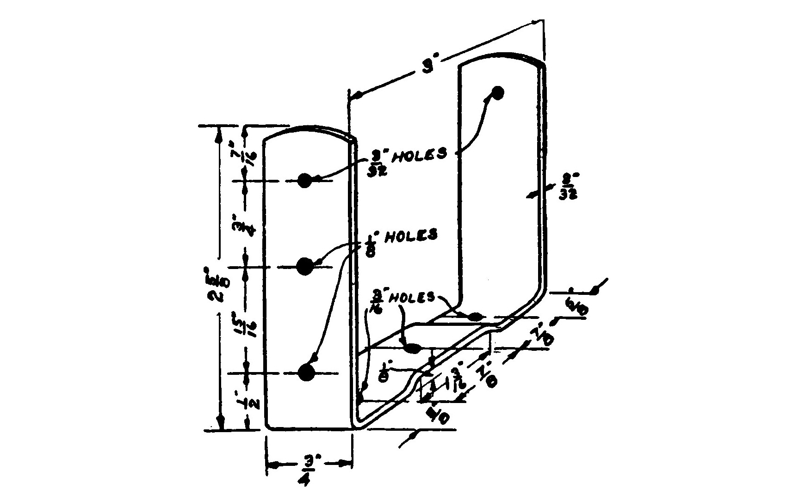
   
   FIG. 54.—The Main Bearings. 

**The Shaft** will probably prove the most difficult part 
of the engine to make properly. The details are given 
in Figure 55. It is made of a piece of one-eighth inch 
steel rod bent so that a crank is formed in the middle. 
The crank should be bent so that it has a "throw" of 
one-half an inch, that is, offset one-quarter of an inch 
so that the connecting rod moves back and forth a 
distance of one-half an inch. The finished shaft should 
be three inches long. The piece of steel used should 
be longer than this and so that it can be cut off to 
exact dimensions after the shaft is finished. A second 
crank should be bent in one end of this so as to form 
an offset contact for the brushes. This second crank 
will have to be at right angles to the first one and 
should be much smaller. The ends of the shaft are 
turned or filed down to a diameter of 
three-thirty-seconds of an inch for a distance of about the same 
amount so that they will fit in the bearing holes and 
turn freely, but not allow the shaft to slip through. 
The work of making the shaft will require a small vise, 
a light hammer, files and a couple of pliers. One pair 
of pliers should be of the round nosed type and the 
other a pair of ordinary square jawed side cutters. 
It may require two or three attempts before a perfect 
shaft is secured. When finished, it should be 
perfectly true and turn freely in the bearings. The 
bearings can be adjusted slightly by bending, so that the 
shaft will fit in the holes and be free, but yet not loose 
enough to slip out. 

**The Armature** is a strip of soft iron, two and 
one-eighth inches long, seven-sixteenths of an inch wide 
and three-sixteenths of an inch thick. A one-sixteenth 
inch slot, three-eighths of an inch long is cut in one 
end. A one-sixteenth inch hole is drilled through 
from one side to the other, one-eighth of an inch from 
each end. The hole which passes through the slot is 
used tu pass the pin which pivots the armature to the 
connecting rod. The other hole is used to mount the 
armature in its bearing. The armature bearing is a 
small edition of the one which is used to support the 
engine shaft. The details and the dimensions are given 
in the lower left hand side of Figure 56. The armature 
is shown in the center of the same illustration. The 
connecting rod is illustrated at the right. This is made 
from a strip of three-sixty-fourths inch brass, three 
sixteenths of an inch wide and one and five-eighths 
inches long. The one-eighth inch hole should be 
drilled close to one end and a one-sixteenth inch hole 
close to the other. 

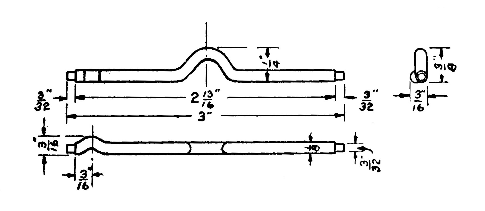
   
   FIG. 55.—The Shaft. 

**The Brushes** are two strips of thin phosphor bronze 
sheet, two and three-sixteenths inches long and nine 
thirty-seconds of an inch wide. They are illustrated 
in Figure 57. The block upon which they are mounted 
is hard fibre. It is one and five-eighths inches long 
and three-eighths of an inch square. 

It may be possible to secure a flywheel for the engine 
from some old toy. It should be about three and 
one-half inches in diameter. A flywheel can be made out 
of sheet iron or steel by following the suggestion in 
Figure 58, which shows a wheel cut out of one-eighth 
inch sheet steel. It is given the appearance of having 
spokes by boring six three-quarter inch holes through 
the face as shown. The hole in the center of the wheel 
should be one-eighth of an inch in diameter. The 
wheel is slipped over the shaft and fastened in position 
by soldering. 

The parts are now all ready to assemble into the 
complete engine. Mount the electromagnets in the 
frame and fasten the frame down to the wooden base 
so that one end of the frame comes practically flush 
with the left hand edge of the base. Fasten the 
bearing across the frame at right angles by a screw passing 
through the center hole in the bottom of the bearing 
through the hole A and into the base. The bottom of 
the bearing should be bent slightly so as to straddle 
the frame. The bearing should be secured and 
prevented from turning or twisting by two screws passed 
through the other two holes in the bottom Use round 
headed wood screws in mounting the bearing and 
the frame.

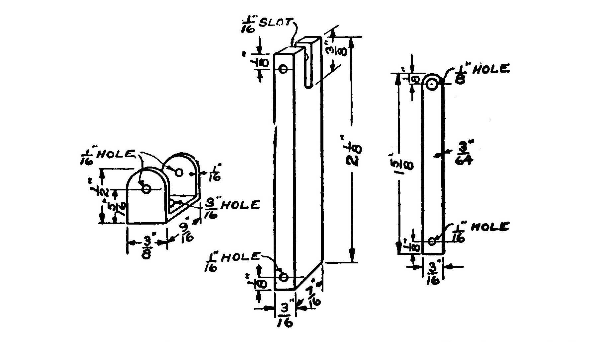
   
   FIG. 56.—Showing the Armature, Armature Bearing and the Connection Rod. 

The armature bearing should be mounted on the 
frame directly between the two electromagnets. Then 
place the armature in position by slipping a piece of 
one-sixteenth inch brass rod through the bearing holes 
and the hole in the lower part of the armature. 

Solder the flywheel in position on the shaft and snap 
the latter into the bearings. Adjust the bearings so 
that the shaft will turn freely. The connecting rod 
should be slipped over the shaft before it is placed in 
the bearings. Fasten the other end of the connecting 
rod to the armature by means of a piece of 
one-sixteenth inch brass rod which passed through the small 
holes bored for that purpose. When the flywheel is 
spun with the fingers, the armature should move back 
and forth between the two electromagnets and almost, 
but not quite, touch the two magnet poles. 

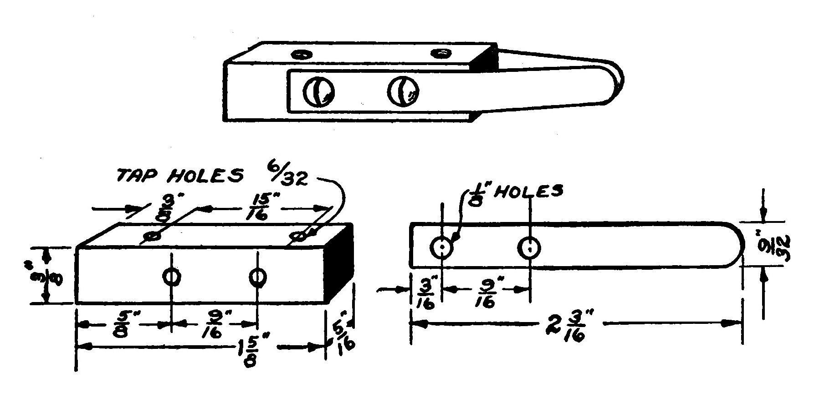
   
   FIG. 57.—Details of the Brushes and Brush Holder. 

All the moving parts should be fitted firmly together 
but be free enough so there is no unnecessary friction 
and so that the engine will continue to run for a few 
seconds when the flywheel is spun with the fingers. 

The brushes, supported on their fibre blocks, should 
be mounted on the bearing by means of two screws 
passing through the holes in the bearing into the block. 
The position of the brushes should be such that the 
shaft passes between the two upper ends but does not 
touch them unless the small "contact" crank 
mentioned above is in proper position to do so. The 
proper adjustment of the brushes so that they will 
make contact with the shaft at the proper moment 
will largely determine the speed and power which the 
finished engine will develop. 

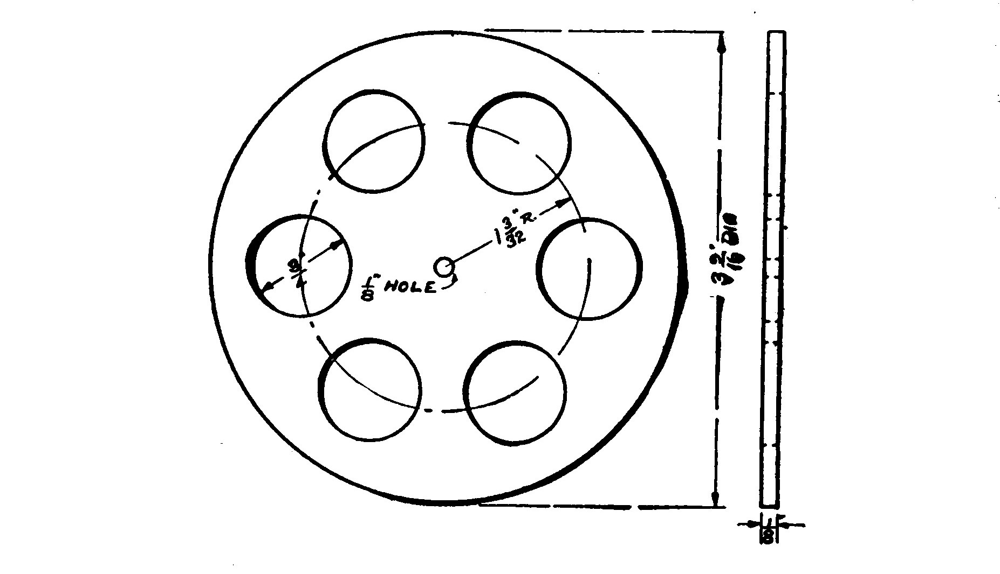
   
   FIG. 58.—Showing how a Flywheel may be made out of sheet iron. 

Two binding posts should be mounted on the right 
hand end of the base so that the engine can be easily 
connected to a battery. Connect one terminal of the 
right hand electromagnet to one of the binding posts. 
Run the other terminal of the electromagnet to the 
brush on the opposite side of the shaft. Connect one 
terminal of the left hand electromagnet to the other 
binding post and run the other terminal to the brush 
on the opposite side of the shaft. Save for a few 
minor adjustments, the engine is now ready to run. 
Connect two or three cells of dry battery to the two 
binding posts and turn the flywheel so that it moves 
from right to left across the top. Just as the crank 
passes "dead center" and the armature starts to move 
back away from the left hand magnet, the small 
contact crank on the shaft should touch the left hand 
brush and send the current through the right hand 
magnet. This will draw the armature over to the 
right. Just before the armature gets all the way over 
to the right, the contact should break connection with 
the left hand brush and interrupt the current so that 
the inertia of the flywheel will cause it to keep moving 
and the armature to start to move over toward the 
left hand magnet at which point the contact on the 
shaft should commence to bear against the right hand 
brush, thus throwing the left hand magnet into 
circuit and drawing the armature over to that side. If 
the brushes and the cranks are in proper relation to 
each other the engine will continue to repeat this 
operation and gradually gain speed until it is running 
at a good rate. 

The appearance of the engine can be improved by 
painting the metal parts black and the flywheel red. 
The magnets can be wrapped with a piece of bright 
red cloth to protect the wire against injury and also 
lend attraction to its appearance in this way. 

CHAPTER IV SMALL POWER MOTORS
-----------------------------

In order for a motor to develop any appreciable 
amount of power it must be much larger than any 
of those which have been described in these pages so 
far, and must be constructed in a most painstaking 
manner. It will be necessary to use a great deal more 
iron in the field and armature and also to make the 
space between them as small as possible. A motor 
having a small separation between the field poles and 
the armature will develop more power than one having 
a greater separation. 

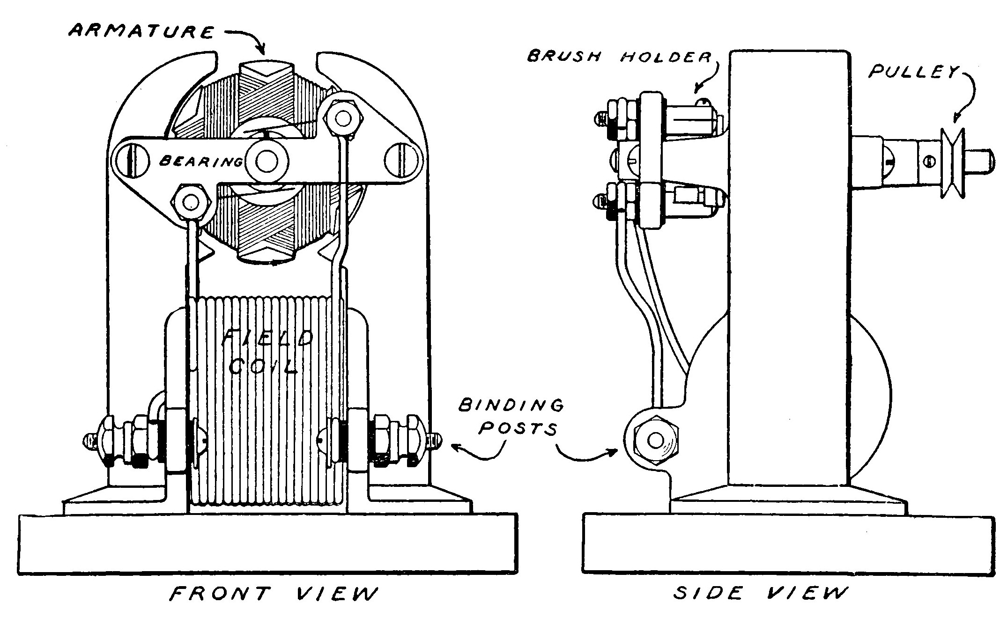
   
   FIG. 59.—A Vertical Battery Power Motor. 

The most efficient types of small power motors have 
laminated field and armature frames, that is, they are 
built up of a large number of thin metal punchings. 
The amateur experimenter who has limited facilities 
for carrying out his work would find it difficult to 
make parts of this sort to good advantage and so the 
motors described here have been designed with cast 
iron armatures and field frames. 

Those who wish to secure a set of castings from 
their own patterns can possibly save part of the 
expense if they do not consider the extra labor of first 
making the patterns. 

Two types of motors are described, one vertical and 
the other horizontal. Both are intended to operate on 
a battery current of 3-6 volts and if carefully built 
will deliver a surprising amount of power. 

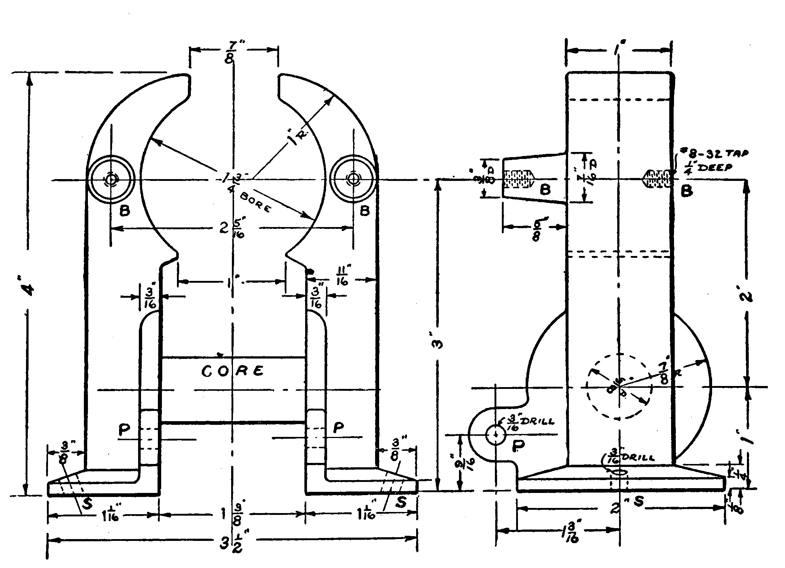
   
   FIG. 60.—Details of the Field Frame of the Vertical Motor. 

A VERTICAL POWER MOTOR 
``````````````````````

**The Field Frame** is shown in detail in Figure 60. 
The exact shape and dimensions are best understood 
by a careful examination of the drawing. 

The pattern for the field may be made of the same 
shape and practically the same size as indicated for 
the finished casting because the "rapping" or jarring 
which the pattern will receive in the foundry in order 
to free it from the sand mould will enlarge the mould 
sufficiently in a casting of small size to make up for 
any shrinkage which takes place upon the cooling of 
the iron. 

The only exception to this is in the tunnel where 
the armature rotates. This should measure one and 
three-quarter inches in diameter when finished and 
should be slightly smaller in the rough casting so that 
there is enough material to allow for truing and 
bringing to equal size. 

**The Armature** may be of two types, three pole or 
six pole. The three-pole armature is the simpler, but 
the six-pole type is the smoother running and gives 
the steadier power. The details and dimensions are 
shown in Figures 61 and 62. One of the armatures 
should be selected and a pattern built. 

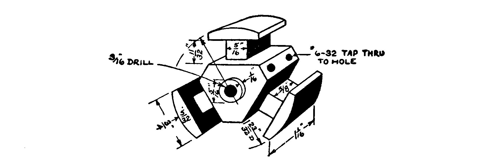
   
   FIG. 61.—Three-pole Armature. 

After the patterns are finished they should be given 
a coat of shellac and carefully rubbed with fine 
sandpaper so that they are perfectly smooth. Otherwise 
the sand is liable to stick in moulding and produce an 
imperfect casting. 

Castings may be obtained from any foundry which 
is equipped to make grey iron castings. They should 
be as soft as possible. The cost will depend upon the 
quantity which are ordered. If only one set is 
required, the charge will probably be based upon the 
time required for making the moulds but if several 
sets are ordered the price may be based upon the 
weight. 

After the castings have been received from the 
foundry, the first operation is to carefully remove all 
rough spots and burrs with a file. 

Those who have a lathe or large drill press can 
easily finish the tunnel by turning or reaming. In 
the absence of these facilities, hand filing can be made 
to suffice, if carefully done. 

The holes marked "BBBB" should be drilled with 
a No. 29 drill and tapped 8-32. These holes must be 
very carefully located because they serve to fasten the 
bearings. Each hole should be exactly opposite the 
other, two and five-sixteenth inches apart and on a 
line passing exactly through the centre of the tunnel. 

The holes, "PP" and "SS", are three-sixteenths of 
an inch in diameter. The former support the Binding 
Posts and the latter pass the screws which fasten 
the motor to the wooden base. 

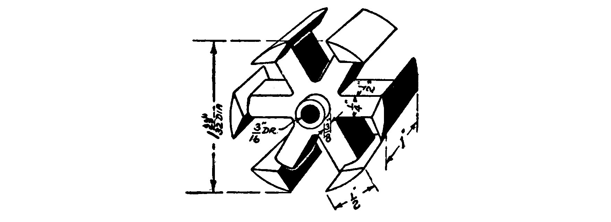
   
   FIG. 62.—Six-pole Armature. 

The armature, in the case of either the six or three 
pole type, has a three-sixteenth inch hole drilled along 
the axis to accommodate a steel shaft of the same 
diameter. 

The armature casting should be accurately turned 
to a diameter of one and twenty-three thirty-seconds 
of an inch so that it will revolve in the tunnel 
without touching the field but still be very close to it. 

Two holes bored through one of the pole pieces at 
right angles to the shaft with a No. 37 drill and 
threaded with a 6-32 tap will allow the armature to 
be clamped tightly to the shaft with two headless set 
screws. 

**The Field Winding** consists of No. 16 double cotton 
insulated wire. Before the winding is put on, the core 
should be insulated with one or two layers of shellaced 
paper. Two circular pieces of shellaced paper should 
be placed against the flanges at the end of the 
core, so that the winding space is thoroughly 
insulated and there is no liability of the wire touching the 
iron at any point. The wire should be wound in smooth 
even layers. The winding space is completely filled. 
The outside layer may be finished by a coat of shellac. 

The three-pole armature is much easier to wind than 
the six pole type. The wire used should be No. 24 
\B. & S. Gauge, double cotton covered. Before the 
wire is wound on, cover the winding space with 
shellaced paper so that the wire will not touch the 
iron at any point. Each coil should be wound in the 
same direction as the others starting at the same end 
and as close as possible to the inside. 


   
   FIG. 63.—Showing how the Coils on a Three-pole Armature are connected to the Commutator. 

The outside end of each coil should be connected 
to the inside of the next coil as shown in Figure 63. 
The diagram indicates only one layer of wire in each 
coil for the sake of clearness. 

The winding upon the armature shown in Figure 
64 is divided into six coils. Each coil consists of as 
many turns as possible of No. 24 B. & S. Gauge, cotton 
covered wire to fill the space completely and all coils 
are wound in the same direction. The illustrations 
show the various stages of the bindings with the two, 
four and six coils in place. The winding spaces on 
the armature should be carefully insulated with 
shellaced paper before the coils are placed in position. 

After the winding has been finished the next step 
is to make the shaft and commutator. The shaft is a 
piece of three-sixteenths steel, three and one-quarter 
inches long. The shaft passes through the centre of 
the armature and is locked-in position by the two set 
screws. 

**The Commutator** is probably one of the most 
difficult parts of the motor to make. It consists of three 
circular brass sections insulated from one another on 
a fibre bushing. 

The fibre bushing is a hollow cylinder, 
five-sixteenths of an inch in diameter and seventeen 
thirty-seconds of an inch long. The bushing should force 
tightly on the shaft. The segments are make by 
turning a piece of three-quarter inch brass rod in a lathe 
until it is one-half an inch in diameter for a distance of 
about seven-sixteenths of an inch. A five-sixteenths 
inch hole should be bored through the center so that 
it will fit tightly upon the fibre bushing. 

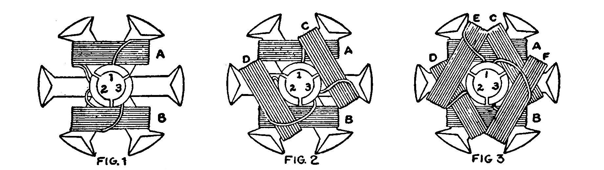
   
   FIG. 64.—Showing how the Coils on a Six-pole Armature are arranged and connected. 

Then cut the brass off one-half inch from the end 
so that it leaves a flange at one end, three-quarters of 
an inch in diameter. Saw it lengthwise into three 
equal parts and mount it upon the fibre bushing with 
a small strip of mica between each two sections to 
fill in the space made by the saw cuts. The sections 
are held together by a fibre ring, three quarters of an 
inch in diameter outside and one-half an inch in 
diameter inside. The ring should fit very tightly over 
the commutator and be forced down flush against the 
shoulder. After the ring is in position, file any mica 
which may project out of the slots down even with 
the surface of the segments and force the commutator 
onto the shaft with the shoulder against the armature. 
The commutator must fit very tightly so that there 
is not any possibility of moving it after it is in position. 

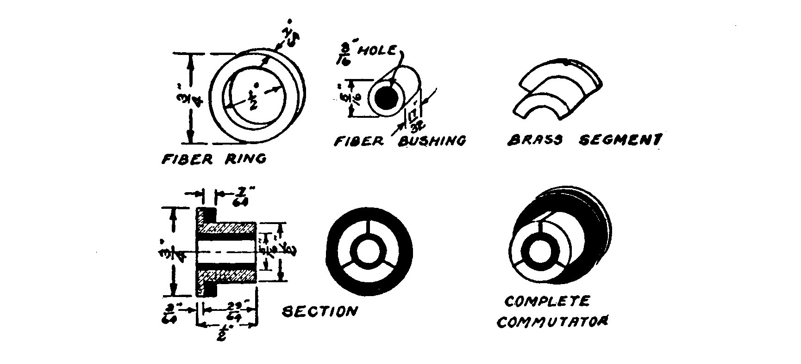
   
   FIG. 65.—Details of the Commutator.

The sections should bear a certain relative position 
to the armature windings. The diagrams in Figures 
63 and 64 show the proper position for the three and 
six pole armature respectively. 

The coils are connected to the commutator by 
soldering the terminals to the shoulder on each 
segment. This work should be very carefully done so as 
to insure a neat job and connection of the proper 
terminal to the proper section. 

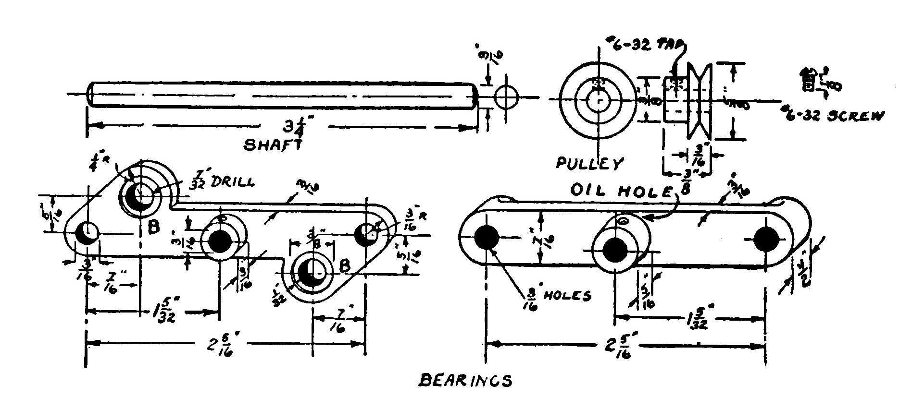
   
   FIG. 66.—Details of the Bearings, Shaft, and Pulley.

CONNECTIONS FOR THE THREE POLE ARMATURE
``````````````````````````````````````` 

The inside terminal of coil A and the outside 
terminal of coil B should be connected to Section 1, the inside 
terminal of coil B and the outside terminal of coil C 
should be connected to Section 3, the inside terminal 
of coil C, and the outside terminal of coil A should be 
connected to Section 2. 

CONNECTIONS FOR THE SIX-POLE ARMATURE 
`````````````````````````````````````

The inside terminal of coil A and the inside terminal 
of coil B should be connected to section 2, the outside 
terminal of coil C and the outside terminal of coil D 
should be connected to Section 3, the outside terminal 
of coil E and the outside terminal of coil F should be 
connected to Section 1, the outside terminal of coil A 
and the inside terminal of coil C should be connected 
to Section 1, the inside terminal of coil D and the 
inside terminal of coil E should be connected to Section 
2, the inside terminal of coil F and the outside terminal 
of coil D should be connected to Section 3. 

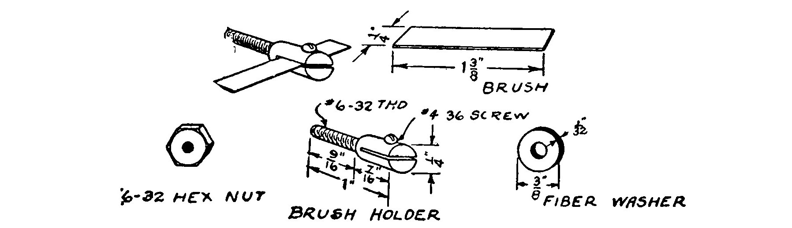
   
   FIG. 67.—The Brushes and Brush Holder. 

The wires leading from the coils to the commutator 
should be just as short as it is possible to make them 
and after being soldered should be bound down tightly 
with linen thread or string. 

The bearings are both cast from brass. The details 
are shown in Figure 66 It will be necessary to make 
up wooden patterns and send them to a foundry. The 
location of the holes can be ascertained from the 
illustration. 

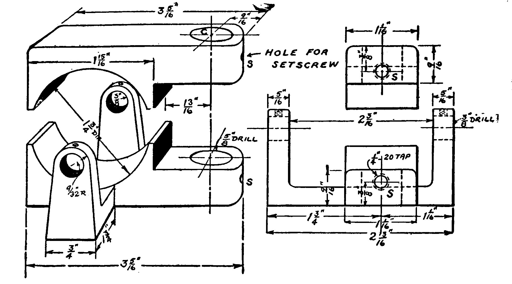
   
   FIG. 68.—Details of the Field Frame for the Horizontal Power Motor. 

Each of the brushes consists of a piece of strip 
copper, one-quarter of an inch wide and one and 
three-eighths inches long mounted in a brush holder made 
of one-quarter inch brass rod. The brush holder is 
one inch long and is turned down to a diameter of 
one-eighth of an inch at one end for a distance of 
nine-sixteenths of an inch and then threaded with a 6-32 
die. The opposite end is slotted to receive the brush. 
The threaded portion of the holder is slipped through 
the holes, "B and B", in the bearing and prevented 
from making contact with the latter by a fibre bushing. 

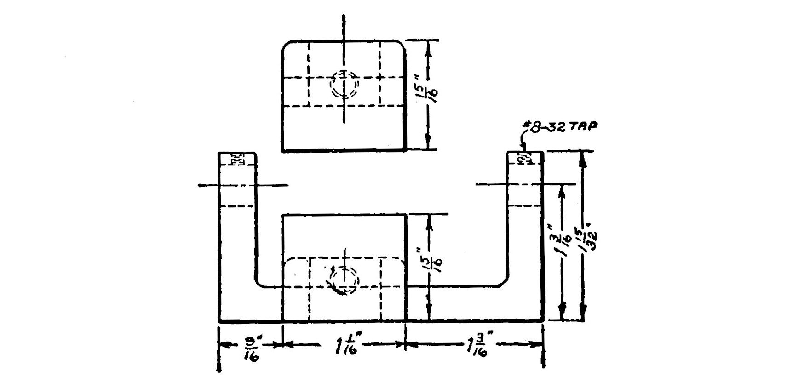
   
   FIG. 69.—Front view of the Field Frame. 

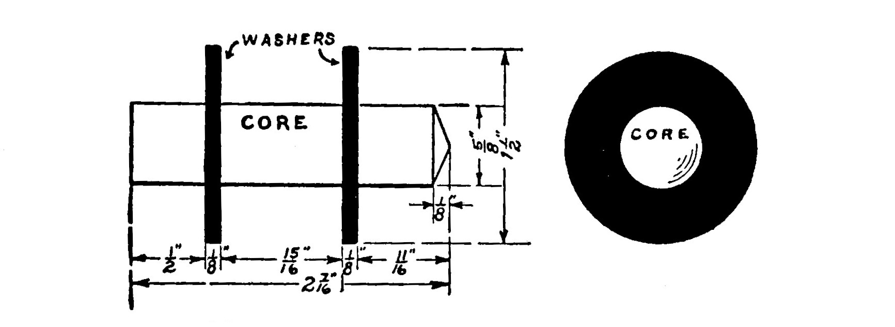
   
   FIG. 70.—The Field Magnet Bobbin. 

A fibre washer should also be slipped over the holder 
on each side of the bearing. Two hexagonal nuts are 
placed on the threaded stem. One serves to clamp the 
holder in position and the other to hold the wire used 
to make connection with the brush. The right hand 
brush should bear against the under side of the 
commutator and the left hand brush against the upper 
side. 

After the armature has been assembled in the 
bearings and mounted on the field frame it should revolve 
freely without friction and without any possibility of 
its striking against the field poles. 

The binding posts are mounted in the holes, "PP" 
in the lower parts of the field frame. They are 
insulated by two fibre or paper busings. The left hand 
binding post is connected to the inside terminal of the 
field winding. The outside terminal of the field 
winding is connected to the left hand binding post. The 
right hand binding post is connected to the right hand 
brush. 

The base of the motor is a wooden block of suitable 
size. 

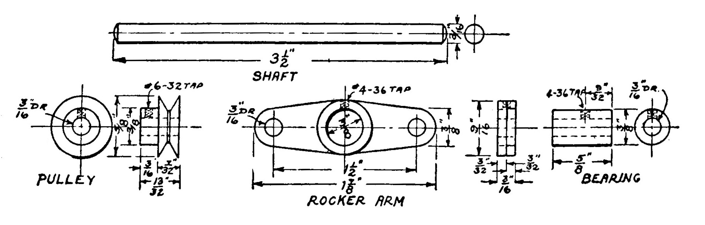
   
   FIG. 71.—Details of the Shaft, Rocker Arm, Bearing and Pulley. 

The motor is of the series type because all the 
current flows through both the field and armature. A 
current of 2 to 6 volts will operate the motor. The pulley 
or gear required in order that the motor may be used 
as a source of power will depend upon the work for 
which the motor is to be employed. A small grooved 
pulley such as as that shown in Figure 63 may be 
fastened to the shaft with a set screw and will prove 
most useful for general purposes. 

A HORIZONTAL POWER MOTOR. 
`````````````````````````

The horizontal motor does not differ very materially 
from the vertical one just described. 

The field frame is, however, made in two pieces, and 
the bearings are cast directly on the frame. The details 
and dimensions are given in Figures 68, 69 and 70.

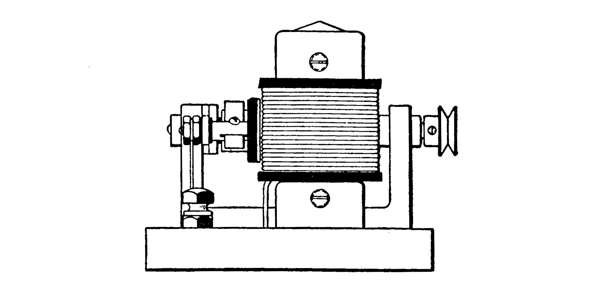
   
   FIG. 72.—Rear view of the completed Horizontal Motor.

The field winding consists of six layers of No. 18 
\B. & S. Gauge double cotton-covered wire wound on 
a spool or bobbin. 

The core of the bobbin consists of a piece of 
five-eighths round steel or iron rod, two and 
seven-sixteenths inches long. Two circular fibre heads, 
one-eighth of an inch thick and one and one-half inches in 
diameter are mounted on the core one-half an inch 
from one end and fifteen-sixteenths of an inch apart. 
The ends of the core are set in the holes, "C, C," in 
the two parts of the field frame and held in position by 
two set screws threading into the holes "S" and "S." 

Either the three-pole or the six-pole armature may 
be used. The commutator and brushes are identical 
with those used in the vertical type of motor. 

The shaft is three-sixteenths of an inch in diameter 
and four inches long. The brushes are mounted upon a 
brush arm which is shown in detail in Figure 63. This 
is made of three-sixteenths inch sheet brass. The 
brushes must be insulated from the arm by fibre 
washers and bushings in the same manner as they were 
from the bearings on the vertical motor. 

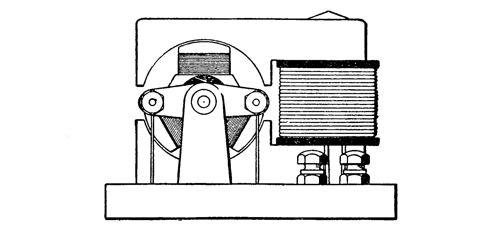
   
   FIG. 73.—Side view of the Horizontal Motor. 

The holes in the bearings on the field frame are 
drilled out three-eighths of an inch in diameter and 
then brushed with a piece of three-eighths inch brass 
rod five-sixteenths of an inch in diameter having a 
three-sixteenths inch hole through the center. 

.. cleardoublepage::
 
.. container:: center large

   Any of the Following 

.. container:: center xx-large

   Practical Books 

.. container:: center large

   .. vspace:: 2

   **will be sent At Once, Post-paid on receipt of price.**

.. container:: center medium

   *There is very little danger of losing currency in a letter if the following directions are observed:*

   .. vspace:: 1

   Cut a circular hole the diameter of 
   
   the coin in a piece of cardboard, of 
   
   sufficient size to fit closely in the 
   
   envelope. The cardboard should 
   
   be no thicker than the coin. 

   .. vspace:: 1

   Insert the coin in the hole and paste 
   
   a piece of paper on both sides of 
   
   the cardboard to prevent the coin 
   
   from falling out. 

.. container:: center x-large

   .. vspace:: 2

   COLE & MORGAN 

.. container:: center medium

   .. vspace:: 2

   Publishers of the Arts and Sciences Series 

   \P.O. Box 473, City Hall Station New York, N. Y. 

.. clearpage::

.. container:: center x-large

   **Experimental Wireless Construction**

.. container:: center large

   **EIGHTY-SIX PAGES NINETY-THREE ILLUSTRATIONS**

   .. vspace:: 2

   **Only 30 Cents, Postpaid**

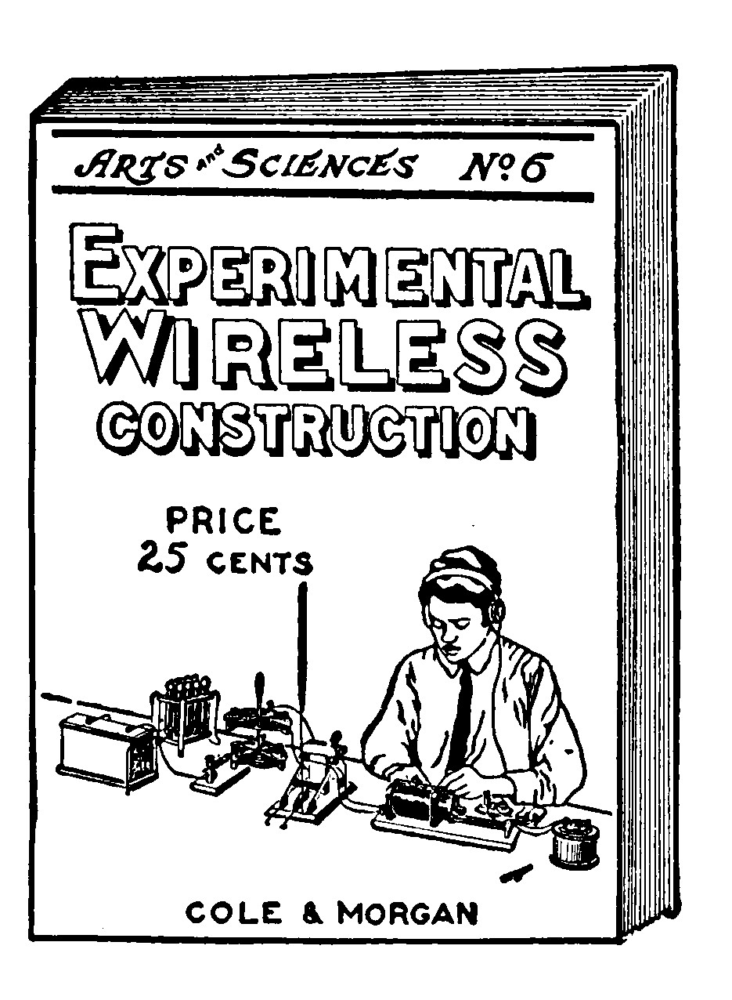

Here at last is the book which every young 
experimenter interested in constructing his 
own wireless apparatus has been looking for. 

A book which tells how to build apparatus 
which anyone would be proud to own. It is 
a more advanced book than "Wireless Construction 
and Installation for Beginners," 
and describes apparatus which is much more 
elaborate and sensitive. The instruments 
have all been the subject of considerable experimental 
work and study. All the apparatus has been put to 
practical test and carefully improved by clever experts. 
By purchasing this book you get the benefit of vast 
knowledge and experience and are enabled 
to build far better instruments than by 
following your own designs and haphazard 
methods. 

.. container:: center large

   .. vspace:: 2

   **Partial Contents**

   .. vspace:: 2

Chapter I.—THE AERIAL. Chapter II.—SPARK COILS. Chapter III.—TRANSMITTING APPARATUS AND ITS CONSTRUCTION. 
Chapter IV.—THE RECEIVING APPARATUS AND ITS CONSTRUCTION. Chapter V.—ARRANGEMENT AND OPERATION OF THE APPARATUS.
COMPLETE DETAILS ARE GIVEN WITH WORKING DRAWINGS.
 
.. container:: center medium

   .. vspace:: 2

   **Sent anywhere postpaid for 30 Cents**

.. clearpage::

.. container:: center large

   **The Boy Electrician**

   .. vspace:: 2

.. container:: center medium

   Practical Plans for Electrical Toys and Apparatus, with an Explanation 

   of the Principles of Everyday Electricity. 

   .. vspace:: 2

   **By ALFRED P. MORGAN.**

   .. vspace:: 2

   Author of "Wireless Telegraph Construction for Amateurs" and "Wireless 

   Telegraphy and Telephony," etc. 

   .. vspace:: 2

   **With full-page Illustrations and 324 Working Drawings and Diagrams**
   
   **by the author. 8vo., Cloth, Net Price, $2.25.**


This is the age of electricity. The most fascinating of all 
books for a boy must therefore be one dealing with the 
mystery of this ancient force and modern wonder, even a 
mere list of whose services is impossible. The best qualified 
of experts to instruct boys, Alfred P. Morgan, has in a book 
far superior to any other of its kind told not only how to 
make all kinds of motors, telegraphs, telephones, batteries, 
etc., and to do so economically, but has explained the principles
upon which these depend for operation, and how the 
same thing is done in the every-day world be well 
presented and so attractive is this really great book that it will 
be an education for any bright boy to have it, as well as 
the best kind of a moral safeguard, by leaving no time or 
thought for evil, and a means of future benefit beyond the 
power of any one to reckon. Glancing over the pages of 
this book, one cannot but be impressed by the excellent 
illustrations, clearness of expression and the large number 
of subjects that are covered. It is beyond doubt the best 
book in this line that has ever been written or published. 
It is a book that will delight every boy who has a leaning 
towards electrical experiments. The author writes in a clear 
and chatty style and while he has a thorough 
technical knowledge of his subject he has succeeded 
in treating it in a simple manner 
so that it is readily intelligible to his young readers. 

   .. vspace:: 2

.. container:: center medium

   **Among the Chapter Headings and Contents are:**

Magnets and Magnetism—Static Electricity—Static Electric Machines—Cells and Batteries—Electro-Magnetism and Magnetic Induction—Electrical Units—Electrical Appurtenances—Electrical Measuring Instruments—Bells, Alarms and Annunciators—Electric Telegraphs—Microphones and Telephones—Induction Coils—Transformers—Wireless Telegraphy—Wireless Telephony—Electric Motors—Dynamos—An Electric Railway—Miniature Lighting—Miscellaneous Electrical Apparatus. 

   .. vspace:: 2

.. container:: center medium

   **READ WHAT HAS BEEN SAID OF IT.**

"Even a casual glance through the many pages of the book does not fail to 
emphasize the fact that Mr. Alfred P. Morgan has indeed succeeded well in giving the 
juvenile electricians a work that has long been sought."—Popular Electricity. 

"We have no hesitation in commending the book to the attention of the juvenile 
audience for which it is intended."—Boston Post. 

"A great book for enterprising boys. Bright boys will highly appreciate it and feel 
like thanking the wideawake publishers for putting such a reliable and interesting 
work in the field."—New Haven Journal. 

"The book covers the subject of electricity thoroughly in all its phases and is a 
splendid acquisition to any boy’s library."—Detroit Times. 

"In this age of electricity a book like the present one is both fascinating and valuable 
especially to boys. The book is attractive with its many illustrations and will prove 
of much educational value for any bright boy."—Zion’s Herald. 

"This is an admirably complete and explicit handbook for young boys who fall under 
the spell of tinkering with electrical apparatus."—Boston Transcript. 

"Well presented and attractive this book will be a source of great benefit and delight 
for any bright boy."—New Orleans Times-Picayune. 

   .. vspace:: 2

.. container:: center x-large

   **Price, $2.25 Postpaid**

.. container:: center medium

   .. vspace:: 2

   COUNTLESS OTHER MAGAZINES, NEWSPAPERS AND LIBRARIES HAVE 
   
   ENDORSED THIS GREAT BOOK. SEND FOR A COPY NOW. 

   .. vspace:: 2

   **If you are interested in this great book, write for our 8-page special**

   **descriptive circular.**

.. clearpage::

.. container:: center x-large

   Wireless Telegraphy and Telephony Simply Explained 

.. container:: center x-large

   By ALFRED P. MORGAN. 

   **A NEW BOOK by the author of "Wireless Telegraph Construction for Amateurs."**


This is undoubtedly one of the most complete and 
comprehensive treatises on the subject ever published, and a close 
study of its pages will enable one to master all the details 
of the wireless transmission of messages. The author has 
tilled a long-felt want and has succeeded in furnishing a 
lucid, comprehensible explanation in simple language of the 
theory and practice of wireless telegraphy and telephony. 
The book treats the subject from an entirely new standpoint. 
Several very novel and original ideas have been carried out 
in its making. It is well illustrated by over one hundred 
and fifty interesting photographs and drawings.. All diagrams 
have been made’ in perspective showing the instruments as 
they actually appear in practice. The drawings are carefully 
keyed and labeled. Many of the photographs are accompanied 
by phantom drawings which reveal the name and purpose of 
each part. 

It is a book which the wireless experimenter cannot afford to 
be without. It will prove even more valuable to the layman. 

**Among the contents are: Introductory. Wireless Transmission and Reception. 
The Ether. Electrical Oscillations. Electro magnetic Waves. The Means for 
Radiating and Intercepting Electric Waves. Aerial Systems. Earth Connection. 
The Transmitting Apparatus. Current Supply. Spark Coils and Transformers. 
Condensers. Helixes. Spark Gaps. Anchor Gaps. Aerial Switches, Etc. The 
Receiving Apparatus. Detectors, Etc. Tuning Coils and Loose Couplers. Variable 
Condensers. Tuning and Coupling. Directive Wave Telegraphy. The Dignity of 
Wireless. Its Applications and Service. Wireless in the Army and Navy. 
Wireless on an Aeroplane. How a Message is Sent and Received. The Wireless 
Telephone. The Ear. How We Hear. Sound and Sound Waves. The Vocal Cords. 
The Structure of Speech. The Telephone Transmitter and Receiver. The 
Photophone. The Thermophone. The Selenium Cell.**

**Handsomely Bound in Cloth with Embossed Cover. (Postpaid, $1.00)**

.. clearpage::

.. container:: center x-large

   Build Your Own Wireless Instruments 

   Complete Up-to-the-Minute Authentic Practical

.. container:: center xx-large

   WIRELESS TELEGRAPH CONSTRUCTION FOR AMATEURS 

.. container:: center large

   By ALFRED POWELL MORGAN 

   3d EDITION 

   220 Pages 163 Illustrations

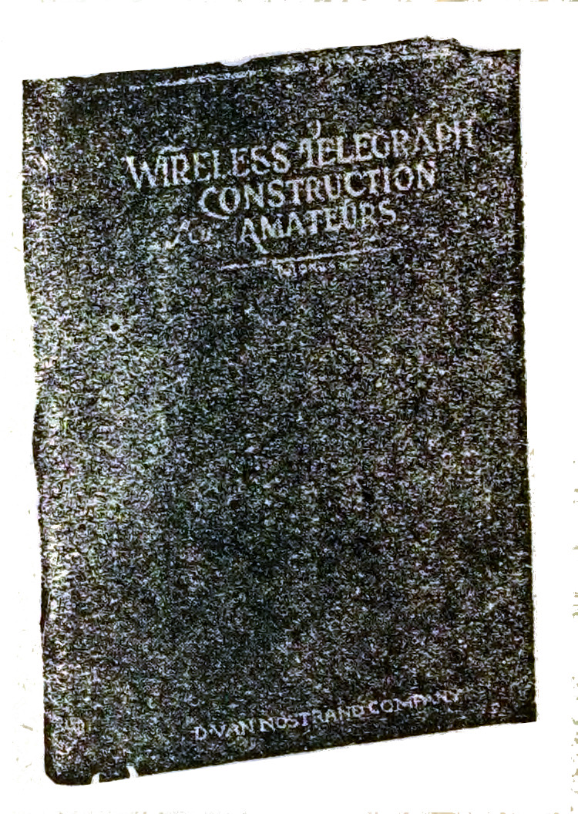

.. container:: center large

   **Price, $1.50, Postpaid**
   
   **Handsomely Bound in Silk Cloth**

Thoroughly up to date and unusually complete. Given
in minute detail, full directions for constructing wireless 
apparatus and various outfits capable of receiving from
100 to 1,500 miles and transmitting 3 to 100 miles. Also 
clearly explains the purpose and action of each instrument. 

Directions for Operating and Adjusting, etc. 

.. container:: center large

   **A SPLENDID TREATISE OF WIRELESS ALONG CONSTRUCTIVE LINES**

.. container:: center medium

   *Price,* $1.50, *Postpaid*

The value of this book has been greatly increased by the addition of much new 
subject matter and many illustrations of recent interest. 

The new text explains fully how to build the most recent forms of Quenched Gaps, 
Rotary Gaps, Dough-Nut Tuners, Kick-back Preventers, Audion Detectors and numerous 
other instruments, accompanied by dimensioned working drawings Several very 
interesting and instructive photographs have been included.

**I.—Introduction. II. The Apparatus. III.—Aerials and Earth Connections. IV.—Induction Coils. 
\V.—Interrupters. VI.—Transformers. VII.—Oscillation Condensers and Leyden Jars. 
VIII.—Spark Gaps or Oscillators. IX.—Transmitting Helixes X.—Keys. 
XI.—Aerial Switches and Anchor Gaps. XII.—Hot Wire Ammeter. 
XIII.—Oscillation Detectors. XIV.—Tuning Coils and Tuning 
Transformers. XV.—Receiving Condensers. XVI.—Telephone Receivers and Headbands. 
XVII.—Operation. XVIII.—The Amateur and the Wireless Law. How to Secure 
a License. Oscillation Helix. Quenched Spark Gap. Rotary Gaps. Kick-Back.
The Variometer. New Crystal Detectors. The Audion.—Appendix.**

.. container:: center medium

   **ENDORSED BY WIRELESS CLUBS THROUGHOUT THE COUNTRY AS BEING
   THE MOST PRACTICAL BOOK PUBLISHED ON WIRELESS.**

   **IF YOU ARE INTERESTED IN WIRELESS YOU NEED THIS BOOK**

.. clearpage::

.. container:: center x-large

   **LESSONS IN WIRELESS TELEGRAPHY**

.. container:: center medium

   (WRITTEN SO THAT YOU CAN UNDERSTAND THEM)

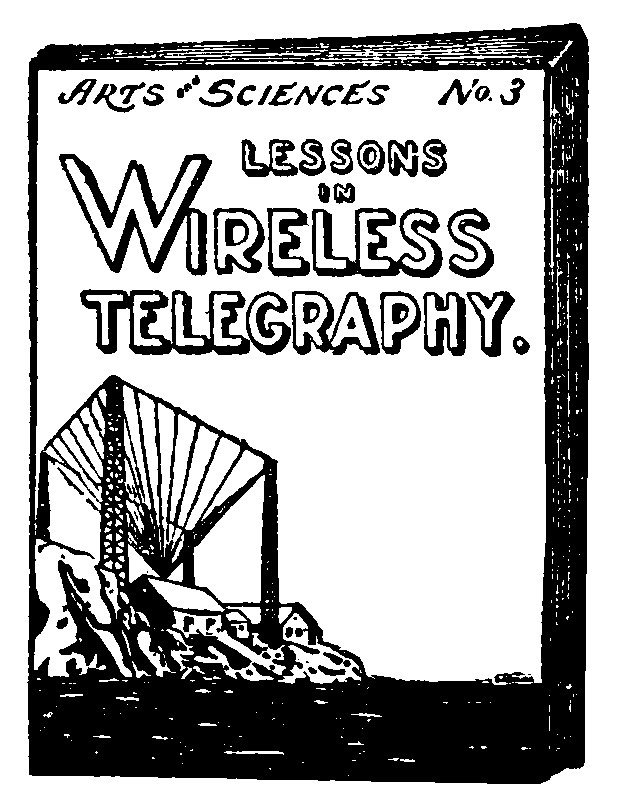

Our new book contains a systematic elementary course 
in the principles of Wireless Telegraphy and the 
electrical laws upon which it depends. It contains more 
reliable and practical information than any other book 
of its kind. 

**IF YOU OWN A WIRELESS OUTFIT** it will give you 
a thorough grounding in the principles and care of the 
efficiency of your apparatus. 

**IF YOU INTEND PURCHASING OR OPERATING 
WIRELESS TELEGRAPH APPARATUS** you could not 
desire a more complete or concise explanation of 
matters it is essential to understand. 

**IF YOU ARE A LAYMAN** the book will prove valuable 
and interesting. It is something that you can well 
afford to read for it will give you a clear conception of 
one of the greatest wonders of the age. 

.. container:: center medium

   **Price, 30 Cents, Postpaid.**

The book is divided into thirty lessons, each lesson dealing with a separate subject 
and following in a logical order so that repetition and possibility of confusion are 
completely avoided. It is profusely illustrated with perspective drawings and 
diagrams, each being carefully keyed so that parts may be readily discerned. 

It not alone describes the actual workings and construction of the instruments that 
go to make up a wireless station in sufficient detail to prove of great value to the 
experienced student but treats the subject in such a manner that even the beginner 
will have no trouble to clearly grasp the matter. 

Among the lists of contents may be mentioned a careful discussion and explanation 
of such subjects as the "why and the wherefore" of Magnetism, Magnetic 
Induction, Primary Cells, Storage Batteries, the Dynamo, the Alternator, the Motor 
Generator, the Induction Coil, the Transformer, the Condenser, Volts, Amperes, 
Watts, Coulombs, Ohm’s Law, Electric Waves, the Ether, Oscillations, the Aerial, 
Spark Gaps, Quenched Gaps, Rotary Gaps, Helixes, Coupling, Tuning, Detectors, 
Tuning Coils, Loose Couplers, Variometers, Condensers, Hot Wire Ammeters, 
Circuits and Diagrams, etc., etc., etc. 

Each subject is discussed in detail and in all its branches. For instance, the lesson 
dealing with aerials describes vertical aerials, pyramid aerials, flat top aerials, 
umbrella aerials, loop aerials, etc., and peculiarities or advantages. The lesson on 
detectors deals with Electrolytic, Perikon, Silicon, Pyron, Carborundum, Magnetic 
and Audion Detectors, etc. The lesson on the theory and arrangement of circuits 
will be found invaluable. 

.. container:: center medium

   **THIS IS THE BOOK THAT YOU HAVE BEEN LOOKING FOR.**

.. clearpage::

.. container:: center xx-large

   Home Made Electrical Apparatus 

Three of the most popular books ever published, filled 
with just the sort of information you have been looking 
for. Each volume is printed on heavy paper and 
contains 72 pages and over 60 illustrations and working 
drawings for making every sort of electrical apparatus, 
all of which has actually been built by the author. 

Written so that you can completely understand them. 

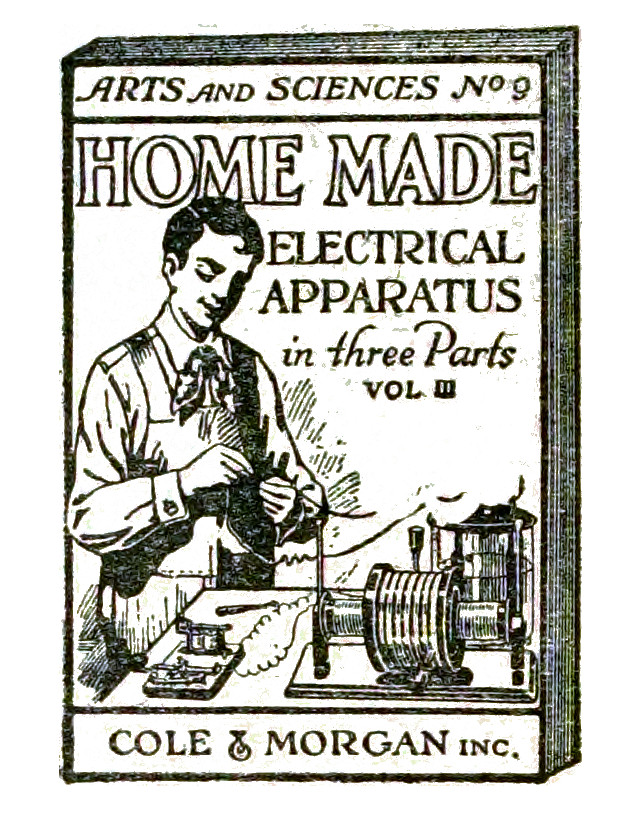

.. container:: center medium

   VOLUME I, No. 7—80 Pages—66 Illustrations

Chapter I—STATIC ELECTRICAL APPARATUS—Static Electricity. How to Build a Wimshurst 
Machine. Experiments with Static Electrical Apparatus. 

Chapter II—CELLS AND BATTERIES. 

Chapter III—HOW TO REDUCE THE 110 VOLT D. C. 
OR A. C. TO A LOWER VOLTAGE FOR EXPERIMENTAL PURPOSES. 

Chapter IV—HOW AN ALTERNATING CURRENT MAY 
BE CHANGED INTO DIRECT CURRENT BY 
MEANS OF AN ELECTROLYTIC RECTIFIER. 

Chapter V—HOW TO BUILD A STEP-DOWN TRANSFORMER FOR REDUCING 
THE 110 VOLT A. C. FOR EXPERIMENTAL PURPOSES. 

.. container:: center medium

   VOLUME II, No. 8—72 Pages—55 Illustrations 

Chapter VI—ELECTRICAL MEASURING INSTRUMENTS. Galvanometers, 
Ammeters, Voltmeters, etc.

Chapter VII—CURRENT CONTROL DEVICES. How to Make a Pole Changing 
Switch or Current Reverser. How to Reverse Small Motors. Battery Rheostats. 

Chapter VIII—HOW TO MAKE A TELEGRAPH KEY AND SOUNDER. How to 
Install a Telegraph Line and Learn to Operate. Learning the Morse Code. 

Chapter IX—HOW TO MAKE AND INSTALL A TELEPHONE. 

Chapter X—MEDICAL COILS AND SHOCKING COILS. 

Chapter XI—THE CONSTRUCTION OF SPARK COILS. A one-quarter inch Coil, 
a one-half inch Coil, a one inch Coil. Experiments with Spark Coils. 

.. container:: center medium

   VOLUME III, No. 9—80 Pages—73 Illustrations 

Chapter XII—HOW TO MAKE A DYNAMO-MOTOR. 

Chapter XIII—HOW TO MAKE A TOY BATTERY MOTOR. 

Chapter XIV—HOW TO BUILD AN ELECTRIC ENGINE. 

Chapter XV—MINIATURE BATTERY LAMP LIGHTING. 

Chapter XVI—COHERER OUTFITS FOR WIRELESS TELEGRAPHY. 

Chapter XVII—HOW TO BUILD A TESLA HIGH FREQUENCY COIL. 
Experiments with High Frequency Currents. 

Chapter XVIII—AN EXPERIMENTAL WIRELESS TELEPHONE. 

Chapter XIX—MISCELLANEOUS APPARATUS. Electrolysis of Water. 
Electro-Plating. Electricity from Heat. A Handy Light. An Experimental Arc 
Lamp. A Magnetic Diver. Magnetic Fish. A Magnetic Clown. An Electric 
Breeze. A Static Motor. 

.. container:: center large

   **Price Postpaid, 30 cents per volume**

All three volumes can be supplied bound together with handsome cloth cover 
for $1.25 postpaid. 

.. clearpage::

.. container:: center xx-large

   Vacuum Tubes in Wireless Communication 

.. container:: center medium

   By ELMER E. BUCHER 

**The only Text Book on the market devoted solely to the 
various applications of the Oscillation Valve.**

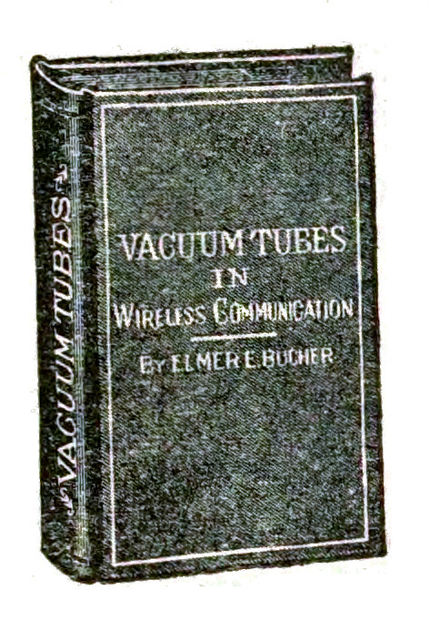

An elementary text book for students, operators, 
experimenters and engineers. Naval wireless men find this book 
especially helpful. Tells in understandable language the 
fundamental operating principle of the vacuum tube. Shows 
over 100 different circuits for the practical use of the 
Vacuum Tube as a Detector, Radio or Audio Frequency 
Amplifier, Regenerative Receiver, Beat Receiver, and 
Generator of Radio Frequency Currents. 

More than 100 diagrams reveal, step by step, in simple 
and direct form, the uses of the vacuum tube. 

**Cloth. Size 6 x 9 inches. 202 pages. 159 diagrams and 
illustrations. Price, $1.75. Postage, 10 cents.**

.. clearpage::

.. container:: center xx-large

   Practical Wireless Telegraphy 

.. container:: center medium

   By ELMER E. BUCHER 

More than 65,000 copies of this book have been sold to 
date. It is used in practically every school, college, library 
and training camp in this country. 

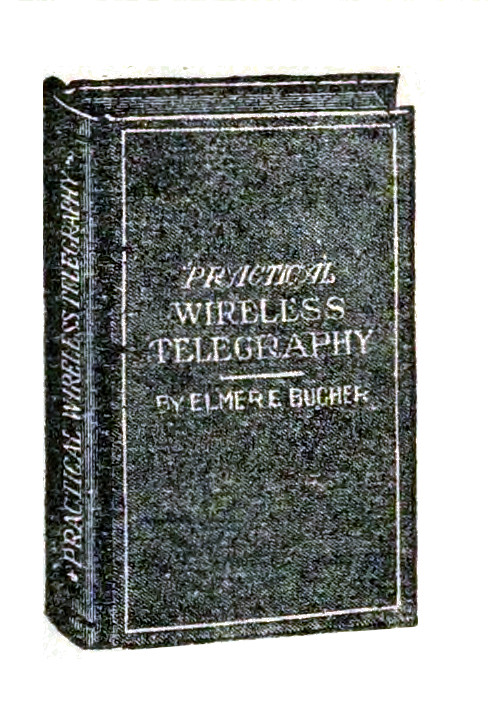

**Practical Wireless Telegraphy** is the recognized standard 
wireless text book. It furnishes much information of utmost 
value in regard to the very latest styles of wireless sets 
now in use. 

It is the first wireless text book to treat each topic 
separately and completely, furnishing a progressive study 
from first principles to expert practice. Starting with 
elementary data, it progresses, chapter by chapter, over 
the entire field of wireless—fundamentals, construction and 
practical operation. 

**Size 6 x 9 inches. 352 pages. 340 illustrations. Handsomely 
bound in full cloth. Price, $1.75. Postage, 10 cents.**

.. clearpage::

.. container:: center xx-large

   Radio Telephony 

.. container:: center medium

   By ALFRED N. GOLDSMITH, Ph D. 

**It is the only book treating the subject of Radio Telephony 
in all its aspects.**

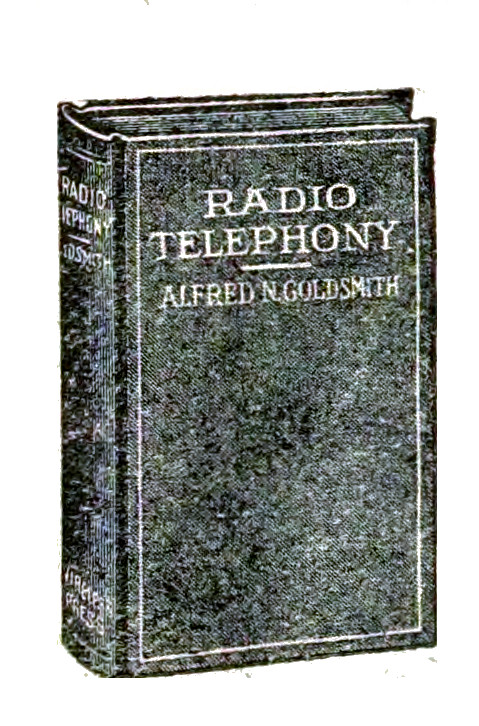

This complete text on radio telephony is intended for 
radio engineers, operators and experimenters, also radio 
electricians in the Navy, men in the Signal Corps and 
especially men in the Aviation Service who handle radio 
equipment. Students and others who desire to be clearly 
informed concerning this newest and most interesting branch 
of electric communication need this book. 

It is written in clear style, and pre-supposes very little 
knowledge of radio. Fully illustrated with wiring diagrams 
and previously unpublished photographs of "wireless 
telephone" apparatus. 

There are over 400 separate topics listed in a carefully 
prepared index. 

**Size 6 x 9 inches. 256 pages. 226 illustrations. Full cloth, 
stamped in gold. Price, $2.00. Postage, 10 cents.**

.. clearpage::

.. container:: center xx-large

   The Operation of Wireless Telegraph Apparatus 

Do your Wireless friends come to you for advice on 
constructing and operating their apparatus or do you go 
to them for information? 

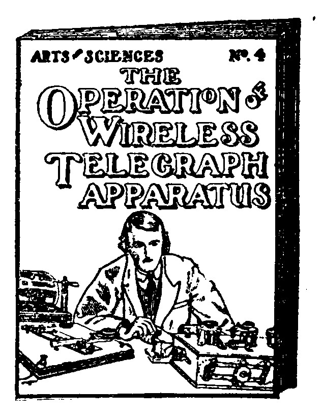

Here is a chance for YOU to become the *authority*. 

**This book is a necessity to every Progressive Experimenter.**

**It shows how to obtain the very highest efficiency from 
any station, and how to comply with the law. How 
to tune, adjust your detector, spark gap, phones, etc.**

.. container:: center medium

   **Price, 30 Cents, Postpaid.**

This book was written for the wireless experimenter who 
has passed the amateur stage, but explains how the 
beginner also can obtain the very best results from his 
station. It contains much useful information to this end 
and many "kinks". 

**IT SHOWS HOW** to receive or send on long or short 
wave lengths with highest efficiency, to tune for longest 
distance reception of messages, to use the buzzer test, 
how to test and connect condensers, receivers, etc., 
how to use receiving transformers, variometers, etc., all with *highest efficiency* in 
view. 

**IT ALSO DESCRIBES** the construction and use of a simple, inexpensive wave 
meter to tune the station to any desired wave length, and tells how to obtain a 
*sharp* wave and a *pure* wave. 

.. clearpage::

.. container:: center x-large

   **Model Flying Machines**

   **HOW TO BUILD AND FLY THEM**

.. container:: center medium

   Will prove interesting and valuable. 

   .. vspace:: 2

   Have you ever built and flown a Model Racer? 

   .. vspace:: 2

   If not, you have missed something. 

   .. vspace:: 2

   Price, 25 Cents, Postpaid. 

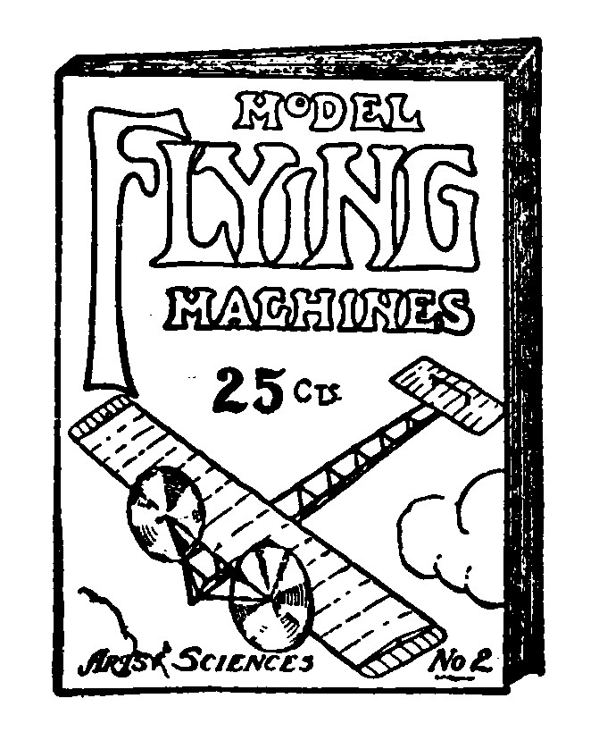

Model Aeroplaning is one of the most fascinating and 
instructive of sports. 

Thousands of young men and boys have formed Model 
Aero Clubs and organized Flying Contests throughout the 
country. 

"MODEL FLYING MACHINES" of the *Arts and 
Sciences* series is the only book giving reliable data and 
instructions for the construction of practical Model 
Aeroplanes. 

IF YOU ARE A BEGINNER, this is the book that you ought to have. It will 
start you right. It tells how to build seven different types of machines, starting 
with the simplest Monoplane and finishing with several Long Distance Racing Models. 

IF YOU ARE INTERESTED IN MODEL AEROPLANING, this book will prove 
the one you have been looking for. Gives valuable "Kinks". Tells how to carve 
propellers, make winders, adjust and fly machines, etc. Fully illustrated with large 
size, detailed working drawings, showing the exact size of each part. Twelve 
full-page plates. 

Printed on first-class paper. Heavy cover in three colors. 

.. container:: center medium

   Sent postpaid by return mail upon receipt of 25 cents. 

   .. vspace:: 2

   **EVERY MODEL AVIATOR OUGHT TO HAVE A COPY**

.. vspace:: 2

.. pgfooter:: 

